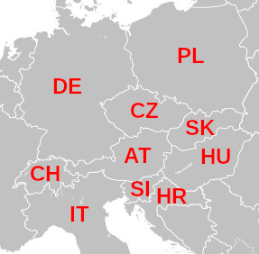

# Prolog programozás 1 - Projekt

## A négyszín-tétel

Mindössze négy szín elég ahhoz, hogy tetszőleges térképen az országokhoz színeket rendeljünk úgy, hogy minden országhatár két különböző színt válasszon el. Ez volt az első olyan matematikai tétel, amelynek bizonyítását számítógéppel adták meg, és ezért sok matematikus kezdetben nem is fogadta el bizonyítottnak, és csak "négyszín-sejtésként" hivatkoztak rá. Minden joguk megvolt rá: a több, mint egy hónapon át futó 1976-os eredeti program állítólag tele volt hibákkal. 20 évvel később azonban egy sokkal hatékonyabb megoldást is találtak, és 2004-ben egy tételbizonyító rendszer is belátta, hogy az állítás mindig igaz.

Mi most bizonyítani nem fogunk, de próbáljuk meg kiszínezni Európa egy szeletét:



Hogy ne kelljen sokat gépelni, jelölje `t` azt, hogy két ország *találkozik*. A találkozáskor a színeknek különbözőeknek kell lennie, tehát felvehetjük a következő tényeket (egyelőre 2 színnel):
```prolog
t(piros, zöld). t(zöld, piros).
```
Ahhoz, hogy a térképünk jó legyen, minden határnál teljesülnie kell egy ilyen találkozásnak:
```prolog
térkép(DE, CH, IT, PL, CZ, AT, SI, HR, SK, HU) :-
    t(DE, PL), t(DE, CZ), t(DE, AT), t(DE, CH),
    t(CH, AT), t(CH, IT),
    t(IT, AT), t(IT, SI),
    t(PL, CZ), t(PL, SK),
    t(CZ, AT), t(CZ, SK),
    t(AT, SK), t(AT, HU), t(AT, SI),
    t(SI, HU), t(SI, HR),
    t(HR, HU),
    t(SK, HU).
```
Mivel a színekre vonatkozó szabályt mindkét sorrendben felvettük, az országok sorrendje mindegy, így elég mindig csak az egyik verziót felírni. Ha most megkérdezzük, hogy
```prolog
?- térkép(DE, CH, IT, PL, CZ, AT, SI, HR, SK, HU).
```
... akkor (nem túl meglepő módon) `false`-ot kapunk.

Vegyünk hozzá még egy színt!
```prolog
t(piros, kék). t(zöld, kék).
t(kék, piros). t(kék, zöld).
```
... még mindig nem elég. (Ez is elég világos - ha Ausztria pl. piros, akkor a szomszédos országokat körbejárva felváltva kéne zöldet és kéket kapnunk, de páratlan ország van körülötte.) Akkor vegyük hozzá a sárgát is!
```prolog
t(piros, sárga). t(zöld, sárga). t(kék, sárga).
t(sárga, piros). t(sárga, zöld). t(sárga, kék).
```
Ha így megnézzük, akkor már jó eredményt ad:
```
AT = PL = zöld,
CH = CZ = SI = kék,
DE = HR = IT = SK = piros,
HU = sárga
```
Az egyetlen szépséghibája a megoldásnak, hogy Szlovénia kék lett, és így egybefolyhat a tenger kékjével. Több lehetőségünk is van:
- Lecseréljük a kéket egy másik színre
- Addig nyomogatjuk a `Next`-et, amíg nem lesz kék színű tengerparti ország
- Felcseréljük a kék és sárga színeket

Tegyük fel, hogy szeretjük a kék színt, és nem akarjuk lecserélni (meg egyébként is akkor már 5 szín kéne!), a másik két megoldás meg nem elég automatikus. Mit tehetünk?

Felvehetjük plusz "országként" a tengert, és megkövetelhetjük, hogy mindig kék legyen:
```prolog
térkép(DE, CH, IT, PL, CZ, AT, SI, HR, SK, HU) :-
    Tenger = kék,
    t(DE, PL), t(DE, CZ), t(DE, AT), t(DE, CH), t(DE, Tenger),
    t(CH, AT), t(CH, IT),
    t(IT, AT), t(IT, SI), t(IT, Tenger),
    t(PL, CZ), t(PL, SK), t(PL, Tenger),
    t(CZ, AT), t(CZ, SK),
    t(AT, SK), t(AT, HU), t(AT, SI),
    t(SI, HU), t(SI, HR), t(SI, Tenger),
    t(HR, HU), t(HR, Tenger),
    t(SK, HU).
```
Ezzel már egy jó megoldást kapunk.

Persze megtehettük volna azt is, hogy a `Tenger`-ek helyett egyszerűen `kék`-et írunk, és akkor nincsen szükség a `Tenger = kék` sorra sem, de egy kicsit kevésbé olvasható lenne a program. Ilyen rövid programoknál még ez nem olyan lényeges, de általában a programozásban fontos arra törekedni, hogy ne csak a számítógép, hanem egy másik ember (és pár hét múlva mi magunk) is megértse, amit írtunk.

## Megjegyzések

Ez a dokumentum az alábbi könyv 1.8. fejezete alapján készült:

I. Bratko: *Prolog Programming for Artificial Intelligence*, 4th Ed., Pearson, 2011.

A négyszín-tételnél a teljes igazsághoz még hozzátartozik, hogy feltétel, hogy az "országok" összefüggőek legyenek, tehát ne legyen egy másik ország, ami kettéválasztja. Ez persze valódi térképeknél sokszor nem teljesül.
