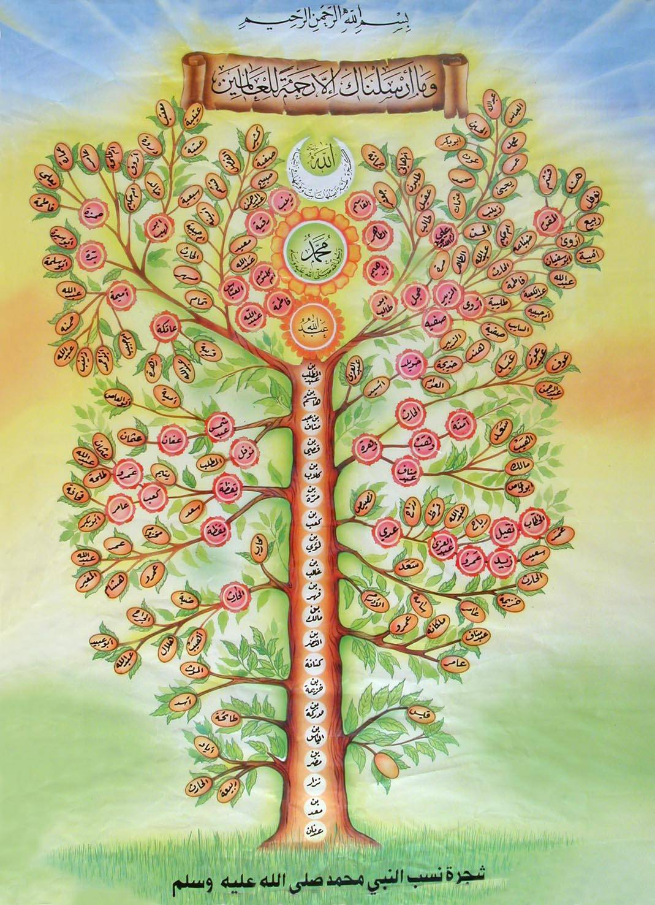

# Prolog programozás 1

## Bevezető

A *Prolog* egy különleges programozási nyelv. Az 1970-es években fejlesztették ki, tehát egy elég régi nyelvről van szó, és a Szeredi Péter által fejlesztett magyar *MProlog* rendszer mérföldkőnek számított a történetében. A Prolog név arra utal, hogy logikai problémák megoldására találták ki, de mindenféle más, érdekes feladatokra is jól használható, és a számítástechnika alapjainak tanítására is kiváló :)

Háttérnek ennyi talán elég is, vágjunk bele! A programokat az [online SWI Prolog](https://swish.swi-prolog.org/) rendszerben ki tudjátok próbálni: a baloldali ablakba lehet írni a programot, a jobb alsóba (a `?-` után) pedig a kérdéseket; a `Ctrl+Enter` billentyűkombináció megnyomására kezdi el a számítást, és az eredmények a jobb felső ablakban jelennek meg.

## Tények

Egy Prolog program *tényekből* és *szabályokból* áll, amikből a számítógép következtetéseket tud levonni. Ha megadunk egy tény- és szabályrendszert, utána kérdéseket tehetünk fel, amiket a gép legjobb tudása szerint megválaszol.

Példaként vegyük Mohamed próféta családját!
```
 Abú Tálib --- Abdulla === Ámna
     |                  |
     |                  |
     |               Mohamed === Hadídzsa
     |                        |
     |                        |
    Ali === Fátima ----------------- Zajnab
         |                             |
         |                             |
Huszajn --- Muhszin --- Haszan       Umáma
```
(Ez csak egy nagyon kis részlete a családfának, és még ezen a részen belül sem tartalmaz minden kapcsolatot, mert pl. Ali Fátima halála után feleségül vette Umámát is. Egy teljesebb fát betettem a dokumentum végére.)

A szülő-gyerek kapcsolatokat az alábbi program foglalja össze:

```prolog
szülő(abú_tálib, ali).
szülő(abdulla, mohamed).
szülő(ámna, mohamed).
szülő(mohamed, fátima).
szülő(hadídzsa, fátima).
szülő(mohamed, zajnab).
szülő(hadídzsa, zajnab).
szülő(ali, huszajn).
szülő(fátima, huszajn).
szülő(ali, muhszin).
szülő(fátima, muhszin).
szülő(ali, haszan).
szülő(fátima, haszan).
szülő(zajnab, umáma).
```

Ebben a programban minden sor egy *tény*. Egy tény dolgok (itt emberek) közti kapcsolatot ír le. A formája a következő: adunk neki valami nevet (most ez a `szülő`), utána zárójelek között vesszővel elválasztva felsoroljuk a kapcsolatban levő dolgokat, és a végén egy ponttal (`.`) zárjuk.

Talán furcsa lehet, hogy minden kisbetűvel van - majd később lesz szó arról, hogy mik az elnevezés pontos szabályai, egyelőre azt jegyezzétek meg, hogy minden *konkrét* dolog kisbetűvel írandó, és nem lehet benne szóköz.

### Egyszerű kérdések

Már egy ilyen egyszerű program esetén is lehet értelmes kérdéseket feltenni. Például megkérdezhetjük, hogy
```prolog
?- szülő(mohamed, fátima).
```
... amire a rendszer a `true` (igaz) üzenettel válaszol, vagy hogy
```prolog
?- szülő(ali, zajnab).
```
... amire a `false` (hamis) eredményt adja.

Egy kicsit érdekesebb a következő kérdés:
```prolog
?- szülő(mohamed, Kicsoda).
```
Erre azt a feleletet kapjuk, hogy `Kicsoda = fátima`. Ha rányomtok az eredmény alatt levő `Next` (következő) gombra, akkor még azt is kiírja alá, hogy `Kicsoda = zajnab`.

Mi történt itt? Azáltal, hogy a második helyre egy nagybetűs szót (`Kicsoda`) írtunk, azt mondtuk, hogy ez egy határozatlan, ismeretlen érték. A kérdést tehát magyarul úgy lehetne megfogalmazni: "Mohamed kinek a szülője?"

Erre alapból megkeresi az első választ, amit talál (`fátima`), és ha továbbit kérünk tőle, akkor megtalálja `zajnab`-ot is, és látja, hogy nincs több, és így leáll.

Ha kisbetűvel írtuk volna:
```prolog
?- szülő(mohamed, kicsoda).
```
... akkor a `false` eredményt kaptuk volna, hiszen `kicsoda` itt egy konkrét dolgot jelöl, a kérdés tehát azt jelenti: "Igaz-e, hogy Mohamed szülője Kicsodának?"

A kérdés a másik irányban is feltehető:
```prolog
?- szülő(Ki, ali).
```
... tehát "Ki Ali szülője?", amire a `Ki = abú_tálib` feleletet kapjuk.

Még tovább is mehetünk, és rákérdezhetünk az összes szülő-gyerek kapcsolatra:
```prolog
?- szülő(Ki, Kinek).
```
... azaz "Ki kinek a szülője?". Az első válasz az lesz, hogy
```
Ki = abú_tálib,
Kinek = ali
```
... és a `Next` nyomogatásával a többit is megkaphatjuk. (A `10` és `100` gombok rendre a következő 10 ill. 100 megoldást mutatják meg.)

### Összetett kérdések

Tegyük fel, hogy arra vagyunk kíváncsiak, hogy kik Mohamed unokái. Hogyan tudjuk ezt megkérdezni? Az unoka az a gyerek gyereke, tehát tudjuk, hogy van valaki, aki szülője az unokának, és akinek a szülője Mohamed. A logikai *és*sel összekötött, együtt teljesítendő feltételeket vesszővel választjuk el:
```prolog
?- szülő(mohamed, Valaki), szülő(Valaki, Unoka).
```
Négy megoldást is talál:
```
Unoka = huszajn,
Valaki = fátima
Unoka = muhszin,
Valaki = fátima
Unoka = haszan,
Valaki = fátima
Unoka = umáma,
Valaki = zajnab
```
(Ezek páronként értendők, tehát Fátimától van Huszajn, Muhszin és Haszan, és Zajnabtól Umáma.)

A kérdés két tagjának sorrendje felcserélhető, tehát ugyanezt az eredményt adja ez is:
```prolog
?- szülő(Valaki, Unoka), szülő(mohamed, Valaki).
```
(Majd látni fogjuk viszont, hogy a számításigényük nem azonos, érdemesebb az erősebb megszorítással kezdeni.)

Hasonlóan rákérdezhetünk, hogy kik Huszajn nagyszülei:
```prolog
?- szülő(Valaki, huszajn), szülő(Nagyszülő, Valaki).
```
... amire megkapjuk Abú Tálibot, Mohamedet és Hadídzsát.

Ha arra vagyunk kíváncsiak, hogy Haszan és Huszajn testvérek-e, így fogalmazhatjuk meg:
```prolog
?- szülő(Valaki, haszan), szülő(Valaki, huszajn).
```
Azt kapjuk, hogy `Valaki = ali`, tehát a válasz igen. Ha `huszajn` helyett `abdulla`-t írunk, akkor `false`-ot kapunk.

### Feladatok

1. Válaszoljátok meg az alábbi kérdéseket először magatok, majd utána ellenőrizzétek a számítógépen!
	- `?- szülő(huszajn, X).`
	- `?- szülő(X, huszajn).`
	- `?- szülő(ámna, X), szülő(X, fátima).`
	- `?- szülő(ámna, X), szülő(X, Y), szülő(Y, haszan).`
2. Fogalmazzátok meg Prologban!
	- Ki Ali szülője?
	- Umámának van gyereke?
	- Ki Zajnab nagyszülője?
3. Készítsétek el a saját családfátokat (nagyszülőkig és unokatestvérekig)!

## Szabályok

Eddig csak tényekkel foglalkoztunk, de valójában a Prolog programok nagy része *szabályokból* áll. Először is egészítsük ki a programunkat a szereplőink nemével!

```prolog
férfi(abú_tálib).
férfi(abdulla).
férfi(mohamed).
férfi(ali).
férfi(huszajn).
férfi(muhszin).
férfi(haszan).

nő(ámna).
nő(hadídzsa).
nő(fátima).
nő(zajnab).
nő(umáma).
```

Ha most a `szülő` mellett szeretnénk `anya` és `apa` kapcsolatokat is létrehozni, ezt megtehetjük egyenként:
```prolog
anya(ámna, mohamed).
anya(hadídzsa, fátima).
...
apa(abú_tálib, ali).
apa(abdulla, mohamed).
...
```
... de ez elég sok munka, és érezzük, hogy felesleges, hiszen kikövetkeztethető.

Sokkal egyszerűbb ezt egy-egy szabállyal megoldani:
```prolog
anya(X, Y) :- szülő(X, Y), nő(X).
apa(X, Y) :- szülő(X, Y), férfi(X).
```
A `:-` jelet itt úgy olvashatjuk ki, hogy "akkor, ha", tehát "X anyja Y-nak akkor, ha X szülője Y-nak és X nő". A baloldalon levő részt a szabály *fej*ének, a jobboldalát a szabály *törzs*ének nevezzük.
  
Mi történik, amikor feltesszük az alábbi kérdést?
```prolog
?- anya(ámna, mohamed).
```
A rendszer megtalálja az `anya` szabályt, és *egyesíti* az `X`-et `ámna`-val, az `Y`-t pedig `mohamed`-del. (Az egyesítésről még később szó lesz, itt egyszerűen helyettesítést jelent.) Ezután megnézi, hogy a szabály jobboldalán levő feltétel teljesül-e; ez most `szülő(ámna, mohamed), nő(ámna)`, és ezek a tények szerepelnek a programban, tehát `true`-val tér vissza.

Definiáljuk a "nagyszülő" kapcsolatot!
```prolog
nagyszülő(X, Z) :- szülő(X, Y), szülő(Y, Z).
```
Ez pontosan követi azt, ahogy megkerestük valakinek a nagyszülőjét.

### Problémás esetek

Hogyan tudnánk megadni a "fivér" kapcsolatot?
```prolog
fivér(X, Y) :- szülő(Z, X), szülő(Z, Y), férfi(X).
```
Tehát X fivére Y-nak, ha van egy közös szülőjük és X férfi.

Itt érdemes megjegyezni, hogy bár Abú Tálib és Abdulla testvérek voltak, a
```
?- fivér(abú_tálib, abdulla).
```
kérdésre `false` a válasz, mivel a programnak nincs arról tudomása, hogy lenne közös szülőjük. (A Prolog mindent hamisnak vesz, amit az általa ismert adatokból nem tud kikövetkeztetni, és ez időnként furcsa következményekkel járhat - erről majd később.)

Egy másik problémába ütközünk, ha Mohamed fivéreire vagyunk kíváncsiak:
```prolog
?- fivér(mohamed, X).
```
Az eredmény, meglepő módon, `X = mohamed`! Ebből látszik, hogy a definíciónk nem volt elég pontos; hozzá kell venni azt is, hogy senki nem fivére önmagának:
```prolog
fivér(X, Y) :- szülő(Z, X), szülő(Z, Y), férfi(X), X \= Y.
```
Itt a `\=` jelentése "nem azonos".

### Többféle olvasat

Készítsük el a
```prolog
vangyereke(X) :- szülő(X, Y).
```
szabályt.

Ennek az az érdekessége, hogy többféleképpen is ki lehet olvasni:

1. Ha X szülője Y-nak, akkor X-nek van gyereke.
2. X-nek van gyereke, ha X szülője valakinek.

A két olvasat egyenértékű.

Ha ezt a szabályt beírjátok a programba, egy figyelmeztetés fog megjelenni, hogy az `Y` egy "singleton variable", azaz egy egyszeri változó. Ez csak annyit jelent, hogy az `Y`-t sehol nem használjuk, ezért nem fontos neki nevet adni. Az ilyen névtelen változók helyett az alsóvonás (`_`) jelet szokás használni, vagy egy ezzel kezdődő nevet (pl. `_Y`). Ha ilyenre átírjátok, akkor a figyelmeztetés is eltűnik.

### Feladatok

1. Fordítsátok le Prologra!
	- Akinek van gyereke, az boldog. (`boldog` szabály)
	- Minden X-re, ha X-nek van egy gyereke akinek van egy fivére, akkor X-nek két gyereke van. (`kétgyerekes` szabály)
2. Készítsétek el az `unoka` szabályt! Teszteljétek a saját családfátokon!
3. Csináljatok egy `nagybácsi` szabályt a `szülő` és `fivér` segítségével! Keressétek meg vele Robin unokahúgait és unokaöccseit!

## Rekurzív szabályok

Adjunk még egy utolsó szabályt a programunkhoz: az *ős* fogalmát. Valakinek az őseit úgy kapjuk meg, hogy felfelé megyünk a családfában: ős a szülő, a nagyszülő, a dédszülő stb. Ezt elkezdhetjük írni szabályokkal:
```prolog
ős(X, Z) :- szülő(X, Z).
ős(X, Z) :- szülő(X, Y), szülő(Y, Z).
ős(X, Z) :- szülő(X, Y1), szülő(Y1, Y2), szülő(Y2, Z).
ős(X, Z) :- szülő(X, Y1), szülő(Y1, Y2), szülő(Y2, Y3), szülő(Y3, Z).
...
```
Ez nagyon jól működik, de véges - bármennyi ilyen programsort írok, mindig tudok eggyel feljebb menni a családfában, és azt már nem kezeli.

Egy kis trükkel meg tudjuk ezt oldani: azt mondjuk, hogy ha X gyereke őse Z-nek, akkor X is őse Z-nek:
```prolog
ős(X, Z) :- szülő(X, Y), ős(Y, Z).
```
Ez így magában még azonban nem elég, mert így ahhoz, hogy valaki ős legyen, mindig valaki másnak is ősnek kéne lennie, valahol ennek meg kéne állnia. Elég hozzávenni a legegyszerűbb esetet, amikor a szülő az ős:
```prolog
ős(X, Z) :- szülő(X, Z).
ős(X, Z) :- szülő(X, Y), ős(Y, Z).
```
Ez a kettő együtt már működik. X őse Z-nek, ha vagy (i) X szülője Z-nek, vagy (ii) X szülője Y-nak és Y őse Z-nek. Próbáljátok ki, mit ad az
```prolog
?- ős(X, huszajn).
```
kérdés!

### Feladat

Tegyük fel, hogy az `ős` definícióját megváltoztatjuk!
```prolog
ős(X, Z) :- szülő(X, Z).
ős(X, Z) :- szülő(Y, Z), ős(X, Y).
```
Jó ez így? Miért?

## A teljes program

Itt van minden tény és szabály, amiről szó volt. A programban a `%` jel megjegyzések hozzáadására használható, a rendszer szempontjából a `%`-tól jobbra levő szöveg érdektelen, mintha ott se lenne.

```prolog
% szülő(X, Y) -> X az Y szülője
szülő(abú_tálib, ali).
szülő(abdulla, mohamed).
szülő(ámna, mohamed).
szülő(mohamed, fátima).
szülő(hadídzsa, fátima).
szülő(mohamed, zajnab).
szülő(hadídzsa, zajnab).
szülő(ali, huszajn).
szülő(fátima, huszajn).
szülő(ali, muhszin).
szülő(fátima, muhszin).
szülő(ali, haszan).
szülő(fátima, haszan).
szülő(zajnab, umáma).

férfi(abú_tálib).
férfi(abdulla).
férfi(mohamed).
férfi(ali).
férfi(huszajn).
férfi(muhszin).
férfi(haszan).

nő(ámna).
nő(hadídzsa).
nő(fátima).
nő(zajnab).
nő(umáma).

anya(X, Y) :- szülő(X, Y), nő(X).     % X az Y anyja
apa(X, Y) :- szülő(X, Y), férfi(X).   % X az Y apja

nagyszülő(X, Z) :- szülő(X, Y), szülő(Y, Z).

fivér(X, Y) :- szülő(Z, X), szülő(Z, Y), férfi(X), X \= Y.

vangyereke(X) :- szülő(X, _).

ős(X, Z) :- szülő(X, Z).
ős(X, Z) :- szülő(X, Y), ős(Y, Z).
```

## Megjegyzések

Ez a dokumentum az alábbi könyv 1.1-1.3 fejezete alapján készült:

I. Bratko: *Prolog Programming for Artificial Intelligence*, 4th Ed., Pearson, 2011.

A példaprogram hagyományos értékrendre épít, de igyekeztem nem kizárni az LGBTQ eseteket :) 

### Mohamed próféta családfája


