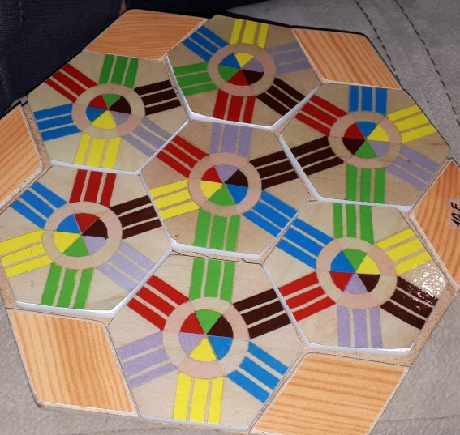

# Prolog programozás 2 - Projekt

Most már készen állunk arra, hogy egy kicsit komolyabb feladatot is megnézzünk.

Az alábbi játékban az a cél, hogy a 7 színes hatszöget úgy helyezzük le, hogy mindig csak azonos színek találkozzanak:



Ahhoz, hogy megoldjuk ezt a feladatot, először valahogy le kell írnunk az ismert tényeket - tehát itt azt, hogy milyen lapok léteznek. A lapok színeit egy `l` struktúrába fogjuk össze, és a következő tényeket kapjuk:

```prolog
lap(l(fekete, lila, sárga, kék, zöld, piros)).
lap(l(fekete, zöld, piros, kék, sárga, lila)).
lap(l(fekete, zöld, lila, sárga, kék, piros)).
lap(l(fekete, lila, piros, sárga, zöld, kék)).
lap(l(fekete, piros, kék, sárga, zöld, lila)).
lap(l(fekete, sárga, zöld, kék, piros, lila)).
lap(l(fekete, zöld, piros, lila, sárga, kék)).
```

Így például végig tudunk menni a lapokon a
```prolog
?- lap(L).
```
kérdés segítségével.

A lapok tetszőlegesen elforgathatóak, tehát a forgatásukra is kell valami mód. Ehhez először egyezzünk meg abban, hogy pontosan milyen elhelyezést jelent a színeknek egy sorrendje:
```
   5
6     4

1     3
   2
```
Tehát az első szín van délnyugatra, a második délre, ... a hatodik északnyugatra. Egy forgatás során annyi történik, hogy valamelyik másik szín kerül előre, de utána a sorrend változatlan. Ezt így írhatjuk le:
```prolog
forgat(l(A,B,C,D,E,F), l(A,B,C,D,E,F)).
forgat(l(A,B,C,D,E,F), l(B,C,D,E,F,A)).
forgat(l(A,B,C,D,E,F), l(C,D,E,F,A,B)).
forgat(l(A,B,C,D,E,F), l(D,E,F,A,B,C)).
forgat(l(A,B,C,D,E,F), l(E,F,A,B,C,D)).
forgat(l(A,B,C,D,E,F), l(F,A,B,C,D,E)).
```

A következő feladat, hogy arra adjunk egy szabályt, hogy mikor kapcsolódik helyesen két lap. Ehhez azt is kell tudni, hogy egymáshoz képest hogyan helyezkednek el. A `kapcsolódik(L1, L2, Irány, F1, F2)` azt mondja, hogy ha az `L1` laptól `Irány` irányba helyezzük le az `L2` lapot, akkor a két lap elforgatható egy `F1` illetve `F2` helyzetbe úgy, hogy a találkozásuknál a színek megegyeznek. Itt az irány leírására használhatnánk a fent bevezetett számokat, de jobban olvasható talán, ha égtájakat használunk. Nézzük meg először a `dny` (délnyugat) irányt!

```prolog
kapcsolódik(L1, L2, dny, F1, F2) :-
    forgat(L1, F1), forgat(L2, F2),
    F1 = l(X,_,_,_,_,_),
    F2 = l(_,_,_,X,_,_).
```
A törzs első sora csak annyit mond, hogy az `F1` és `F2` az `L1` és `L2` elforgatottja; a második és harmadik sor pedig azt biztosítja, hogy az elforgatott lapokon a *megfelelő* helyen levő szín megegyezik (a többi nem számít). Mivel az `L1`-től délnyugatra van az `L2`, ezért az `L1` délnyugati (első) színe az érdekes, az `L2`-nek pedig a szemben levő, tehát északkeleti (negyedik) színe.

Teljesen hasonlóan felírhatjuk a többi égtájra is a kapcsolódási szabályokat:
```prolog
kapcsolódik(L1, L2, d, F1, F2) :-
    forgat(L1, F1), forgat(L2, F2),
    F1 = l(_,X,_,_,_,_),
    F2 = l(_,_,_,_,X,_).
kapcsolódik(L1, L2, dk, F1, F2) :-
    forgat(L1, F1), forgat(L2, F2),
    F1 = l(_,_,X,_,_,_),
    F2 = l(_,_,_,_,_,X).
kapcsolódik(L1, L2, ék, F1, F2) :-
    forgat(L1, F1), forgat(L2, F2),
    F1 = l(_,_,_,X,_,_),
    F2 = l(X,_,_,_,_,_).
kapcsolódik(L1, L2, é, F1, F2) :-
    forgat(L1, F1), forgat(L2, F2),
    F1 = l(_,_,_,_,X,_),
    F2 = l(_,X,_,_,_,_).
kapcsolódik(L1, L2, ény, F1, F2) :-
    forgat(L1, F1), forgat(L2, F2),
    F1 = l(_,_,_,_,_,X),
    F2 = l(_,_,X,_,_,_).
```

Most már minden megvan ahhoz, hogy megkeressük a megoldást. Ezt úgy találjuk meg, hogy veszünk 7 különböző (!) lapot, és felírjuk a rájuk vonatkozó kapcsolódási feltételeket:
```prolog
megoldás(F1, F2, F3, F4, F5, F6, F7) :-
    lap(L1),
    lap(L2), L2 \= L1,
    lap(L3), L3 \= L1, L3 \= L2,
    lap(L4), L4 \= L1, L4 \= L2, L4 \= L3,
    lap(L5), L5 \= L1, L5 \= L2, L5 \= L3, L5 \= L4,
    lap(L6), L6 \= L1, L6 \= L2, L6 \= L3, L6 \= L4, L6 \= L5,
    lap(L7), L7 \= L1, L7 \= L2, L7 \= L3, L7 \= L4, L7 \= L5, L7 \= L6,
    kapcsolódik(L1, L2, dk,  F1, F2), kapcsolódik(F1, L7, ék,  F1, F7),
    kapcsolódik(F2, L3, ék,  F2, F3), kapcsolódik(F2, F7, é,   F2, F7),
    kapcsolódik(F3, L4, é,   F3, F4), kapcsolódik(F3, F7, ény, F3, F7),
    kapcsolódik(F4, L5, ény, F4, F5), kapcsolódik(F4, F7, dny, F4, F7),
    kapcsolódik(F5, L6, dny, F5, F6), kapcsolódik(F5, F7, d,   F5, F7),
    kapcsolódik(F6, F1, d,   F6, F1), kapcsolódik(F6, F7, dk,  F6, F7).
```
Itt a lapok számozása szintén a fenti módon történik, a 7-es számú a középső lap. Az első hét sor csak felveszi a lapokat, és biztosítja, hogy mindegyik különböző legyen. Utána jönnek a szabályok - itt egy dologra kell figyelni, hogy (a procedurális olvasat értelmében) a `kapcsolódik` szabályok kielégítése sorrendben történik, ezért amint egy lapot "letettünk", annak meghatározódik a forgatása, tehát onnantól kezdve a forgatás nélküli `L` helyett az elforgatott `F`-et kell használni. Ezzel megköveteljük, hogy a `kapcsolódik`-ban a "sima" és "elforgatott" változat megegyezzen, tehát ne tudja tovább forgatni a lapot.

Keressük meg akkor a megoldást!
```prolog
?- megoldás(F1, F2, F3, F4, F5, F6, F7).
F1 = l(kék, zöld, piros, fekete, lila, sárga),
F2 = l(kék, sárga, lila, fekete, zöld, piros),
F3 = l(fekete, piros, kék, sárga, zöld, lila),
F4 = l(sárga, zöld, kék, piros, lila, fekete),
F5 = l(sárga, kék, fekete, zöld, piros, lila),
F6 = l(fekete, lila, piros, sárga, zöld, kék),
F7 = l(fekete, zöld, lila, sárga, kék, piros)
```

Ebben a programban rengeteg az ismétlés, ami nem túl szép, de a jelenlegi eszközeinkből ennyire futja. Nemsokára megismerkedünk a listákkal, meg a számolással, és akkor a `forgat` és a `kapcsolódik` szabályokat 1-1 sorban meg tudjuk majd oldani, és a `megoldás`-ban a lapok különbözőségét is könnyebben tudjuk majd biztosítani.
