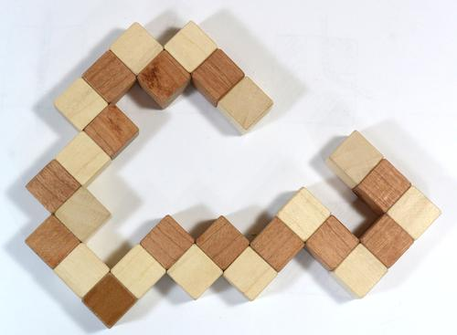

# Prolog programozás 4 - Projekt

## Kígyó-kocka

Oldjuk meg a jól ismert "kígyó-kocka" feladványt:



Az egyes kis szakaszok fixek, de a derékszögű fordulásoknál egymáson elforgathatóak; a feladat, hogy kirakjunk belőle egy 3x3-as kockát.

Szokás szerint azzal kezdjük, hogy felvesszük az adatokat. Ez a készítendő kocka mérete, és a kígyót alkotó szakaszok hosszai:
```prolog
méret(3).
kígyó([3,2,2,3,2,3,2,2,3,3,2,2,2,3,3,3,3]).
```

A teljes kockán belül minden pozíciót 3 koordinátával tudunk jellemezni:
```prolog
pozíció(p(X, Y, Z)) :- méret(N),
    között(1, N, X), között(1, N, Y), között(1, N, Z).
```
Tehát a jelenlegi 3x3-as kocka esetében minden koordináta 1 és 3 között változhat.

A `között` szabály feladatként volt bevezetve, így definiálhatjuk:
```prolog
között(N, M, N) :- N =< M.
között(N, M, X) :- N < M, N1 is N + 1, között(N1, M, X).
```
Itt arra érdemes figyelni, hogy `N > M` esetén ez nem kielégíthető.

Hatféle irányról beszélhetünk, a három tengely irányában pozitív és negatív irányban. Ezeket leírhatjuk olyan módon, mint pl. `i(x, -1)` vagy `i(z, 1)`. Az összes irányt tehát így fogalmazhatjuk meg:
```prolog
irány(i(T, I)) :- tartalmaz(T, [x, y, z]), tartalmaz(I, [-1, 1]).
```
A `T` itt az egyik tengely, az `I` pedig 1 vagy -1, ami a pozitív ill. negatív irányt jelöli.

Két egymás után következő szakasz mindig merőleges egymásra, tehát a *tengelyük* nem lehet azonos:
```prolog
köv_irány(i(T, _), i(T1, I)) :- irány(i(T1, I)), T \= T1.
```

Hogyan változik egy pozíció, ha ellépünk egy adott irányban? A `lépés(P1, I, P2)` akkor lesz igaz, amikor a `P1`-ből `I` irányba ellépve a `P2`-be jutunk:
```prolog
lépés(p(X, Y, Z), i(x, I), p(X1, Y, Z)) :- X1 is X + I.
lépés(p(X, Y, Z), i(y, I), p(X, Y1, Z)) :- Y1 is Y + I.
lépés(p(X, Y, Z), i(z, I), p(X, Y, Z1)) :- Z1 is Z + I.
```
(Ezért volt jó a pozitív/negatív irányt 1-el és -1-el jelölni.)

Próbáljuk meg felírni a megoldást! Legyen a szabályunk `megoldás(K, PL, I, X)`; itt `K` a kígyó hátralevő része, `PL` a már kitöltött pozíciók listája (az elején a kígyó feje, amit épp vizsgálunk), az `I` az aktuális irány, és `X` az irányváltoztatások listája. A reláció akkor teljesül, ha a `PL` pozíció-lista első elemétől `I` irányban indulva le tudjuk rakni a `K` listában levő szakaszokat az `X` listában levő irányokat követve úgy, hogy mindig a kockán belül maradunk, és nem megyünk bele a `PL` egyik elemébe sem. Ekkor a
```prolog
?- kígyó(K), pozíció(P), irány(I),
   megoldás(K, [P], I, X).
```
kérdésre `P` adja a kezdő pozíciót, `I` a kezdő irányt, és `X` az irányváltoztatásokat.

Ha a kígyónak már csak 1 szakasza van hátra, akkor csak azt kell megnézni, hogy azt le tudjuk-e tenni:
```prolog
megoldás([N], PL, I, [I]) :- ellenőriz(PL, I, N, _).
```
Az `ellenőriz(PL, I, N, PL1)` akkor lesz igaz, ha a `PL` elején levő pozícióról az `I` irányban le tudunk helyezni egy `N` hosszú szakaszt anélkül, hogy kimennénk a kockából vagy érintenénk egy `PL`-ben levő pozíciót, és az így bővült pozíció-lista a `PL1`.

Ezt szavakban elmondani bonyolultabb, mint programban:
```prolog
ellenőriz(PL, _, 1, PL).
ellenőriz([P|M], I, N, PL1) :-
    N > 1, lépés(P, I, P1),
    pozíció(P1), nemtartalmaz(P1, M), N1 is N - 1,
    ellenőriz([P1, P|M], I, N1, PL1).
```
Ha a szakasz 1 kockából áll, akkor nincs további teendőnk, és `PL1 = PL`. Egyébként teszünk a megadott irányban egy lépést, megnézzük, hogy érvényes pozíció-e, nem szerepel-e az eddigi pozíciók listájában, és ha ez mind jó, akkor jöhet a többi lépés (aminél a `PL`-et kiegészítjük az új `P1` pozícióval, és a készítendő szakasz hosszát csökkentjük 1-el).

Ha a kígyó több szakaszból áll, akkor először ellépünk az első szakasz hosszával az aktuális irányban, utána új irányt választunk, és rekurzióval elvégezzük a maradékot:
```prolog
megoldás([N|M], PL, I, [I|X]) :-
    ellenőriz(PL, I, N, PL1), köv_irány(I, I1), 
    megoldás(M, PL1, I1, X).
```

Ezzel a fent ismertetett módon megkapjuk a megoldást, de kicsit nehezen olvasható alakban. Fordítsuk le magyarra az irányokat!
```prolog
fordít([], []).
fordít([i(T, I)|M], [F|FM]) :-
    (  T = x, (I = 1, F = jobbra; I = -1, F = balra)
     ; T = y, (I = 1, F = fel;    I = -1, F = le)
     ; T = z, (I = 1, F = előre;  I = -1, F = hátra) ), 
    fordít(M, FM).
```
A `fordít` szabály első argumentuma irányok egy listája, a második pedig az ennek megfelelő fordítások listája. Érdemes megfigyelni a zárójelezés és a logikai vagy jelentésű pontosvesszők használatát.

Végül akkor tegyük az egész megoldót egy szabályba!
```prolog
kígyó_kocka(K, P, FI, FX) :-
    kígyó(K), pozíció(P), irány(I),
    megoldás(K, [P], I, X), fordít([I|X], [FI|FX]).
```

Ha kipróbáljuk:
```prolog
?- kígyó_kocka(K, P, FI, FX).
FI = jobbra,
FX = [jobbra, fel, balra, előre, fel, hátra, jobbra, előre,
      le, balra, fel, hátra, fel, előre, le, jobbra, fel],
K = [3, 2, 2, 3, 2, 3, 2, 2, 3, 3, 2, 2, 2, 3, 3, 3, 3],
P = p(1, 1, 1)
```
... az eredmény már sokkal könnyebben értelmezhető.

A megoldó elég általános ahhoz, hogy más változatokra is használható legyen, pl. a "mean green" feladványra, ha lecseréljük a `kígyó` definícióját:
```prolog
kígyó([3,3,2,3,2,3,2,2,2,3,3,3,2,3,3,3]).
```
Egy másik variáns a "king" feladvány, aminél 4x4-es kockát kell építeni:
```prolog
méret(4).
kígyó([3,2,3,2,2,4,2,3,2,3,2,3,2,2,2,2,
       2,2,2,2,3,3,2,2,2,2,2,3,4,2,2,2,
       4,2,3,2,2,2,2,2,2,2,2,2,4,2]).
```
Ennek sokkal több lehetőséget kell megvizsgálnia, ezért kell neki pár perc - az SWI Prolog netes verziója nem biztos, hogy engedi, de a [letölthető verzióban](https://www.swi-prolog.org/download/stable) ki lehet próbálni.

Megfordíthatjuk a kérdést: hogyan lehet egy számsorozatot készíteni, ami olyan kígyót határoz meg, amiből kocka készíthető? Ehhez a `kígyó`-nak egy új definíciójára lesz szükségünk:
```prolog
kígyó(K) :-
    méret(N), N3 is N^3, N1 is N3 // (N - 1),
    között(N1, N3, H), hossz(K, H),
    kígyó(K, N3).
```
A teljes kígyó hossza a méret köbe (`N3`). A kígyót alkotó szakaszok száma (a kígyónak, mint szakasz-listának a *hossza*, `H`) tehát `N3/(N-1)` és `N3` között lesz, hiszen minden szakasz legfeljebb `N-1` új pozíciót fedhet le. Az egyes szakaszokat ezután a `kígyó/2` segítségével készítjük el:
```prolog
kígyó([], 1).
kígyó([Sz|K], M) :-
    M > 1, méret(N), között(2, N, Sz),
    M1 is M - Sz + 1, kígyó(K, M1).
```
Ha még `M` hosszú kígyót kell csinálni, akkor választunk egy számot 2 és `N` között (egy szakasz hossza csak ilyen lehet), ez lesz a mostani szakaszunk hossza, és a maradék szakaszokkal pedig egy ennyivel rövdebb kígyót csinálunk (pontosabban eggyel hosszabbat, mert egy szakasz utolsó eleme egyben a következő első eleme). Amikor már csak 1 hosszú kígyót kell csinálni, készen vagyunk.

Ezzel a definícióval azt kapjuk, hogy
```prolog
?- kígyó_kocka(K, P, FI, FX).
K = [2, 3, 3, 2, 3, 3, 3, 3, 3, 3, 3, 2, 3, 2, 3],
P = p(1, 2, 2),
FI = le,
FX = [le, jobbra, fel, hátra, le, balra, fel, előre,
      le, jobbra, fel, balra, hátra, le, előre] 
```
(Ez jó sokáig tart.) Mivel a szakaszok számával alulról felfele próbálkozunk, az első megoldás a legkevesebb szakaszból álló kígyó (15 db), amit 3x3-as kockába lehet rendezni. Ha a fenti definícióban a `között(N1, N3, H)` helyett `H = 15`-öt írunk (tehát ha lerögzítjük a szegmensek számát), akkor egész gyorsan lefut, még a netes verzióban is megy.

A futási idő mindig egy kompromisszum: (aránylag) keveset kellett gondolkodnunk ahhoz, hogy megírjuk ezt a programot. Hatékonyabb programot gyakran nehezebb írni, viszont néha elég a lassabb is, pl. olyan feladatoknál, mint a kígyó-generálás, amikor a lényeg csak az, hogy találjunk egy megoldást (még ha akár napokig is kell a gépnek számolnia). Azért persze törekedjünk a hatékonyságra :)

## A teljes program

Mivel ez már egy elég összetett program volt, itt van egyben az egész:

```prolog
tartalmaz(X, [X|_]).
tartalmaz(X, [_|M]) :- tartalmaz(X, M).

nemtartalmaz(_, []).
nemtartalmaz(X, [Y|M]) :- X \= Y, nemtartalmaz(X, M).

hossz([], 0).
hossz([_|M], N) :- hossz(M, N1), N is 1 + N1.

között(N, M, N) :- N =< M.
között(N, M, X) :- N < M, N1 is N + 1, között(N1, M, X).

% Standard
méret(3).
kígyó([3,2,2,3,2,3,2,2,3,3,2,2,2,3,3,3,3]).

% Mean green
% méret(3).
% kígyó([3,3,2,3,2,3,2,2,2,3,3,3,2,3,3,3]).

% King
% méret(4).
% kígyó([3,2,3,2,2,4,2,3,2,3,2,3,2,2,2,2,
%        2,2,2,2,3,3,2,2,2,2,2,3,4,2,2,2,
%        4,2,3,2,2,2,2,2,2,2,2,2,4,2]).

% Generáló
% méret(3).
% kígyó(K) :-
%     méret(N), N3 is N^3, N1 is N3 // (N - 1),
%     között(N1, N3, H), hossz(K, H),
%     kígyó(K, N3).
% kígyó([], 1).
% kígyó([Sz|K], M) :-
%     M > 1, méret(N), között(2, N, Sz),
%     M1 is M - Sz + 1, kígyó(K, M1).

pozíció(p(X, Y, Z)) :- méret(N),
    között(1, N, X), között(1, N, Y), között(1, N, Z).

irány(i(T, I)) :- tartalmaz(T, [x, y, z]), tartalmaz(I, [-1, 1]).

köv_irány(i(T, _), i(T1, I)) :- irány(i(T1, I)), T \= T1.

lépés(p(X, Y, Z), i(x, I), p(X1, Y, Z)) :- X1 is X + I.
lépés(p(X, Y, Z), i(y, I), p(X, Y1, Z)) :- Y1 is Y + I.
lépés(p(X, Y, Z), i(z, I), p(X, Y, Z1)) :- Z1 is Z + I.

ellenőriz(PL, _, 1, PL).
ellenőriz([P|M], I, N, PL1) :-
    N > 1, lépés(P, I, P1),
    pozíció(P1), nemtartalmaz(P1, M), N1 is N - 1,
    ellenőriz([P1, P|M], I, N1, PL1).

megoldás([N], PL, I, [I]) :- ellenőriz(PL, I, N, _).
megoldás([N|M], PL, I, [I|X]) :-
    ellenőriz(PL, I, N, PL1), köv_irány(I, I1), 
    megoldás(M, PL1, I1, X).

fordít([], []).
fordít([i(T, I)|M], [F|FM]) :-
    (  T = x, (I = 1, F = jobbra; I = -1, F = balra)
     ; T = y, (I = 1, F = fel;    I = -1, F = le)
     ; T = z, (I = 1, F = előre;  I = -1, F = hátra) ), 
    fordít(M, FM).

kígyó_kocka(K, P, FI, FX) :-
    kígyó(K), pozíció(P), irány(I),
    megoldás(K, [P], I, X), fordít([I|X], [FI|FX]).
```

## Megjegyzések

A megoldás ötletét az alábbi cikk adta:

Mark P. Jones: *Solving the Snake Cube Puzzle in Haskell*. Journal of Functional Programming 23(2), pp. 145-160, 2013.
