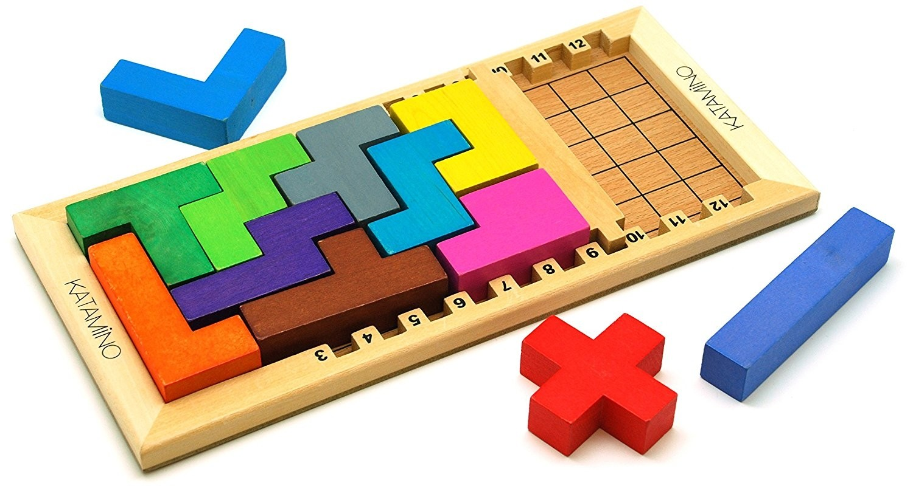

# Prolog programozás 5 - Projekt

## Katamino

Készítsünk megoldót a Katamino-feladványokhoz!



A feladat mindig az, hogy a 12 pentominó egy adott részhalmazából rakjunk ki egy *5xn*-es téglalapot.

### Reprezentáció

Az első lépés továbbra is az, hogy valahogyan le kell írni a gép számára az adatokat, vagyis a használható alakzatokat. Sokféle leírás elképzelhető; itt most csináljuk a következőt: minden egyes alakzatot a körülírható téglalap bal alsó sarkához képest számolt koordinátáival írjuk le.

Például a T-alakzatnál:
```
. . O
O O O
. . O
```
Ha a bal alsó sarok a (0,0) pont, akkor az alakzathoz tartozó pontok a következők: (0,1), (1,1), (2,0), (2,1) és (2,2). A pontokat *x*-koordináta szerint, és azon belül *y*-koordináta szerint rendezve írjuk fel.

Az *x* és *y*-koordináták összefogására bármilyen struktúrát használhatunk, pl. `p(0,1)`, de a tömörség kedvéért szokás a `-` operátort alkalmazni: `0-1`. Bár az egyes forgatások/tükrözések programból is legenerálhatóak, egyszerűbb mindegyiket külön adatként megadni.

A T esetében pl.:

```prolog
alakzat(t, [0-0,0-1,0-2,1-1,2-1]).
alakzat(t, [0-0,1-0,1-1,1-2,2-0]).
alakzat(t, [0-1,1-1,2-0,2-1,2-2]).
alakzat(t, [0-2,1-0,1-1,1-2,2-2]).
```

Hasonlóan lehet definiálni a többi alakzatot, amelyek mind valamilyen 1 betűből álló kódot kaptak: `k`, `p`, `c` stb. (Az összes alakzat, a teljes program forráskódjával együtt, a fájl végén található.)

### Megoldó

A programunk fő szabálya a `kirak` lesz, ami egy alakzat-listához megadja, hogy hogyan fog kinézni a tábla. A megoldás módszere nagyon egyszerű: mindig a (balról/alulról) első lyukat próbáljuk betömni.

```prolog
kirak(Ak, X) :- hossz(Ak, N), kirak(Ak, N, [], X).

kirak([], _, T, T).
kirak(Ak, N, T, X) :-
    első_lyuk(N, T, P),
    töröl(A, Ak, Ak1),
    letesz(A, P, N, T, T1),
    kirak(Ak1, N, T1, X).
```

A 2-argumentumú változat megnézi, hogy hány alakzatot kapott (tehát milyen hosszú a tábla), és meghívja a 4-argumentumú testvérét. Ez a felhasználható alakzatokon (`Ak`) kívül még megkapja a tábla hosszát (`N`), a tábla jelenlegi állapotát (`T`), és ezáltal kiszámolja a kitöltött táblát (`X`).

Ehhez megkeresi az első lyukat, majd kiválaszt (töröl) egy alakzatot, azt leteszi úgy, hogy lefedje a lyukat, és rekurzívan folytatja a műveletet, amíg mindent le nem rak.

A tábla állapotát egy listában tároljuk, aminek az elemei `h(X-Y,A)` alakban adják meg, hogy az `X-Y` pozíción az `A` alakzat egy darabja található. Az első lyuk megkeresése így nagyon egyszerű:

```prolog
első_lyuk(N, T, X-Y) :-
    között(1, N, X), között(1, 5, Y),
    \+ tartalmaz(h(X-Y,_), T), !.
```

Ebből a `között` feladatként fel volt adva korábban:

```prolog
között(N, M, N) :- N =< M.
között(N, M, X) :- N < M, N1 is N + 1, között(N1, M, X).
```

Visszatérve az `első_lyuk`-ra, ez deklaratív olvasatban azt mondja, hogy az `X-Y` koordináták a megfelelő keretek között vannak, és a tábla ezen a pozíción nem tartalmaz elemet. Mitől fogja ez az elsőt adni? Azért, mert a procedurális olvasatból tudjuk, hogy sorban fog próbálkozni, tehát először az `X = 1` eseteket próbálja végig különböző `Y` értékekre, aztán az `X = 2`-t stb., és a végén levő vágásnak köszönhetően nem fog további lyukakat megadni akkor sem, ha a keresés visszalépne ide.

Már csak a `letesz(A, X-Y, N, T, T1)` szabály van hátra. Ez megpróbálja az `A` alakzatot lerakni úgy, hogy lefedje az `X-Y` pontot, ne menjen ki az *5xN*-es táblából, és ne takarjon olyan pozíciókat, amelyek szerepelnek `T`-ben. Ha sikerül, akkor az alakzat lehelyezésével kapott új tábla a `T1`.

```prolog
letesz(A, X-Y, N, T, T1) :-
    alakzat(A, [_-Dy|Dk]),
    Y1 is Y - Dy, Y1 > 0,
    letesz(A, X-Y1, Dk, N, [h(X-Y,A)|T], T1).
```

Ez tehát az `A` alakzatnak kiválasztja egy forgatását, és megnézi az első pontjának az *y*-koordinátáját (`Dy`). Az `Y` koordinátánál ennyivel lejjebb kell rakni az alakzatot, hogy az első pont fedje a lyukat (hiszen az első pont az alakzat legbaloldalibb, és azon belül legalsó pontja). Ha ez a módosult `Y1` koordináta nem pozitív, akkor az alakzat kilóg.

A tényleges lerakási kísérletet a `letesz` 6-argumentumú változata végzi:

```prolog
letesz(_, _, [], _, T, T).
letesz(A, X-Y, [Dx-Dy|Dk], N, T, T1) :-
    X1 is X + Dx, között(1, N, X1),
    Y1 is Y + Dy, között(1, 5, Y1),
    \+ tartalmaz(h(X1-Y1,_), T),
    letesz(A, X-Y, Dk, N, [h(X1-Y1,A)|T], T1).
```

Ez plusz argumentumként megkapja a kiválasztott forgatáshoz tartozó pontokat is (az első kivételéve, amivel a lyukat fedtük), és ezeken megy végig rekurzívan. Minden lépésben a (módosított) `X-Y` koordináta alapján kiszámolja, hogy hova kerül a pont, és ellenőrzi, hogy értelmes-e a koordináta és nincs-e már lefedve `T`-ben.

### Kiíratás

A lényeggel ugyan már készen vagyunk, de az eredmény nehezen olvasható:

```
?- kirak([l,t,w,k,y,r,z,c,p], X).
X = [h(9-5, c), h(9-4, c), h(9-3, c), h(8-5, c), h(8-3, c),
     h(9-2, p), h(9-1, p), h(8-2, p), h(8-1, p), h(7-1, p),
     h(8-4, z), h(7-4, z), h(7-3, z), h(7-2, z), h(6-2, z),
     h(7-5, r), h(6-5, r), h(6-4, r), h(6-3, r), h(5-4, r),
     h(5-5, w), h(4-5, w), h(4-4, w), h(3-4, w), h(3-3, w),
     h(6-1, y), h(5-2, y), h(5-1, y), h(4-1, y), h(3-1, y),
     h(5-3, k), h(4-3, k), h(4-2, k), h(3-2, k), h(2-2, k), 
     h(3-5, t), h(2-5, t), h(2-4, t), h(2-3, t), h(1-5, t), 
     h(2-1, l), h(1-4, l), h(1-3, l), h(1-2, l), h(1-1, l)]
```

Próbáljuk meg kiíratni egy kicsit "grafikusabb" formában! Az elsődleges szabályunk akkor ez lesz:

```prolog
katamino(Ak) :- hossz(Ak, N), kirak(Ak, X), kiír(N, X).
```

A `kiír(N, T)` pedig 5 sorba rendezve szépen kiírja az `N` hosszú `T` táblát. A kiíráshoz a `write(X)` kifejezést fogjuk használni, ami kiírja az `X` értékét, új sor nyitásához pedig a `nl`-t (*newline*, újsor).

```prolog
kiír(N, T) :- kiír(N, 1-5, T).

kiír(_, _-0, _).
kiír(N, X-Y, T) :- Y =< 5, X > N, Y1 is Y - 1, nl, kiír(N, 1-Y1, T).
kiír(N, X-Y, T) :-
    Y =< 5, X =< N,
    tartalmaz(h(X-Y,A), T),
    write(A), write(' '),
    X1 is X + 1,
    kiír(N, X1-Y, T).
```

A 2-argumentumú változat csak átadja a feladatot a 3-argumentumúnak, ami megkapja az éppen kiírandó elem `X-Y` koordinátáját is. Ennek három szabálya van:

1. Ha már a 0. sort kéne kiírni, készen vagyunk.
2. Ha `X > N`, akkor vége az aktuális sornak, új sort kezdünk. Az `Y` koordináta felülről megy lefelé, mert a kiírás is felülről lefelé történik.
3. Egyébként megkeresi, hogy az `X-Y` pozíción melyik alakzat található, és kiírja, utána kiír még egy szóközt, és továbbmegy a következő `X` pozícióra.

Nézzük meg!

```
?- katamino([l,t,w,k,y,r,z,c,p]).
t t t w w r r c c 
l t w w r r z z c 
l t w k k r z c c 
l k k k y z z p p 
l l y y y y p p p 
true
```

És ez éppen az a megoldás, ami a képen van! Erre persze elég jó esély volt, ugyanis a felhasználandó alakzatok listáját hozzávetőlegesen a képen látható megoldás sorrendjében adtuk meg. Egy másik permutáció más megoldást talál meg először:

```
?- katamino([t,w,l,k,r,z,y,p,c]).
w y y y y l l l l 
w w y p p p r r l 
t w w p p z z r r 
t t t k k z c r c 
t k k k z z c c c 
true 
```

### A teljes program

```prolog
katamino(Ak) :- hossz(Ak, N), kirak(Ak, X), kiír(N, X).

% Megoldó

kirak(Ak, X) :- hossz(Ak, N), kirak(Ak, N, [], X).

kirak([], _, T, T).
kirak(Ak, N, T, X) :-
    első_lyuk(N, T, P),
    töröl(A, Ak, Ak1),
    letesz(A, P, N, T, T1),
    kirak(Ak1, N, T1, X).

első_lyuk(N, T, X-Y) :-
    között(1, N, X), között(1, 5, Y),
    \+ tartalmaz(h(X-Y,_), T), !.

letesz(A, X-Y, N, T, T1) :-
    alakzat(A, [_-Dy|Dk]),
    Y1 is Y - Dy, Y1 > 0,
    letesz(A, X-Y1, Dk, N, [h(X-Y,A)|T], T1).

letesz(_, _, [], _, T, T).
letesz(A, X-Y, [Dx-Dy|Dk], N, T, T1) :-
    X1 is X + Dx, között(1, N, X1),
    Y1 is Y + Dy, között(1, 5, Y1),
    \+ tartalmaz(h(X1-Y1,_), T),
    letesz(A, X-Y, Dk, N, [h(X1-Y1,A)|T], T1).

% Kiírás

kiír(N, T) :- kiír(N, 1-5, T).

kiír(_, _-0, _).
kiír(N, X-Y, T) :- Y =< 5, X > N, Y1 is Y - 1, nl, kiír(N, 1-Y1, T).
kiír(N, X-Y, T) :-
    Y =< 5, X =< N,
    tartalmaz(h(X-Y,A), T),
    write(A), write(' '),
    X1 is X + 1,
    kiír(N, X1-Y, T).

% Segéd-szabályok

tartalmaz(X, [X|_]).
tartalmaz(X, [_|Maradék]) :- tartalmaz(X, Maradék).

töröl(X, [X|M], M).
töröl(X, [Y|M], [Y|M1]) :- töröl(X, M, M1).

hossz([], 0).
hossz([_|M], N) :- hossz(M, N1), N is 1 + N1.

között(N, M, N) :- N =< M.
között(N, M, X) :- N < M, N1 is N + 1, között(N1, M, X).

% Alakzatok

% kígyó (lila)
alakzat(k, [0-0,0-1,0-2,1-2,1-3]).
alakzat(k, [0-0,0-1,1-1,1-2,1-3]).
alakzat(k, [0-0,1-0,1-1,2-1,3-1]).
alakzat(k, [0-0,1-0,2-0,2-1,3-1]).
alakzat(k, [0-1,0-2,0-3,1-0,1-1]).
alakzat(k, [0-1,1-0,1-1,2-0,3-0]).
alakzat(k, [0-1,1-1,2-0,2-1,3-0]).
alakzat(k, [0-2,0-3,1-0,1-1,1-2]).
% P-betű (rózsaszín)
alakzat(p, [0-0,0-1,0-2,1-0,1-1]).
alakzat(p, [0-0,0-1,0-2,1-1,1-2]).
alakzat(p, [0-0,0-1,1-0,1-1,1-2]).
alakzat(p, [0-0,0-1,1-0,1-1,2-0]).
alakzat(p, [0-0,0-1,1-0,1-1,2-1]).
alakzat(p, [0-0,1-0,1-1,2-0,2-1]).
alakzat(p, [0-1,0-2,1-0,1-1,1-2]).
alakzat(p, [0-1,1-0,1-1,2-0,2-1]).
% C-betű (sárga)
alakzat(c, [0-0,0-1,0-2,1-0,1-2]).
alakzat(c, [0-0,0-1,1-0,2-0,2-1]).
alakzat(c, [0-0,0-1,1-1,2-0,2-1]).
alakzat(c, [0-0,0-2,1-0,1-1,1-2]).
% W-betű (világoszöld)
alakzat(w, [0-0,0-1,1-1,1-2,2-2]).
alakzat(w, [0-0,1-0,1-1,2-1,2-2]).
alakzat(w, [0-1,0-2,1-0,1-1,2-0]).
alakzat(w, [0-2,1-1,1-2,2-0,2-1]).
% L-betű (narancssárga)
alakzat(l, [0-0,0-1,0-2,0-3,1-0]).
alakzat(l, [0-0,0-1,0-2,0-3,1-3]).
alakzat(l, [0-0,0-1,1-0,2-0,3-0]).
alakzat(l, [0-0,0-1,1-1,2-1,3-1]).
alakzat(l, [0-0,1-0,1-1,1-2,1-3]).
alakzat(l, [0-0,1-0,2-0,3-0,3-1]).
alakzat(l, [0-1,1-1,2-1,3-0,3-1]).
alakzat(l, [0-3,1-0,1-1,1-2,1-3]).
% Y-betű vagy tengeralattjáró (barna)
alakzat(y, [0-0,0-1,0-2,0-3,1-1]).
alakzat(y, [0-0,0-1,0-2,0-3,1-2]).
alakzat(y, [0-0,1-0,1-1,2-0,3-0]).
alakzat(y, [0-0,1-0,2-0,2-1,3-0]).
alakzat(y, [0-1,1-0,1-1,1-2,1-3]).
alakzat(y, [0-1,1-0,1-1,2-1,3-1]).
alakzat(y, [0-1,1-1,2-0,2-1,3-1]).
alakzat(y, [0-2,1-0,1-1,1-2,1-3]).
% I-betű vagy egyenes (kék)
alakzat(i, [0-0,0-1,0-2,0-3,0-4]).
alakzat(i, [0-0,1-0,2-0,3-0,4-0]).
% r-betű (szürke)
alakzat(r, [0-0,0-1,1-1,1-2,2-1]).
alakzat(r, [0-0,1-0,1-1,1-2,2-1]).
alakzat(r, [0-1,0-2,1-0,1-1,2-1]).
alakzat(r, [0-1,1-0,1-1,1-2,2-0]).
alakzat(r, [0-1,1-0,1-1,1-2,2-2]).
alakzat(r, [0-1,1-0,1-1,2-1,2-2]).
alakzat(r, [0-1,1-1,1-2,2-0,2-1]).
alakzat(r, [0-2,1-0,1-1,1-2,2-1]).
% V-betű vagy sarok (kék)
alakzat(v, [0-0,0-1,0-2,1-0,2-0]).
alakzat(v, [0-0,0-1,0-2,1-2,2-2]).
alakzat(v, [0-0,1-0,2-0,2-1,2-2]).
alakzat(v, [0-2,1-2,2-0,2-1,2-2]).
% Z-betű vagy S-betű (kék)
alakzat(z, [0-0,0-1,1-1,2-1,2-2]).
alakzat(z, [0-0,1-0,1-1,1-2,2-2]).
alakzat(z, [0-1,0-2,1-1,2-0,2-1]).
alakzat(z, [0-2,1-0,1-1,1-2,2-0]).
% pluszjel (piros)
alakzat(+, [0-1,1-0,1-1,1-2,2-1]).
% T-betű (zöld)
alakzat(t, [0-0,0-1,0-2,1-1,2-1]).
alakzat(t, [0-0,1-0,1-1,1-2,2-0]).
alakzat(t, [0-1,1-1,2-0,2-1,2-2]).
alakzat(t, [0-2,1-0,1-1,1-2,2-2]).
```
