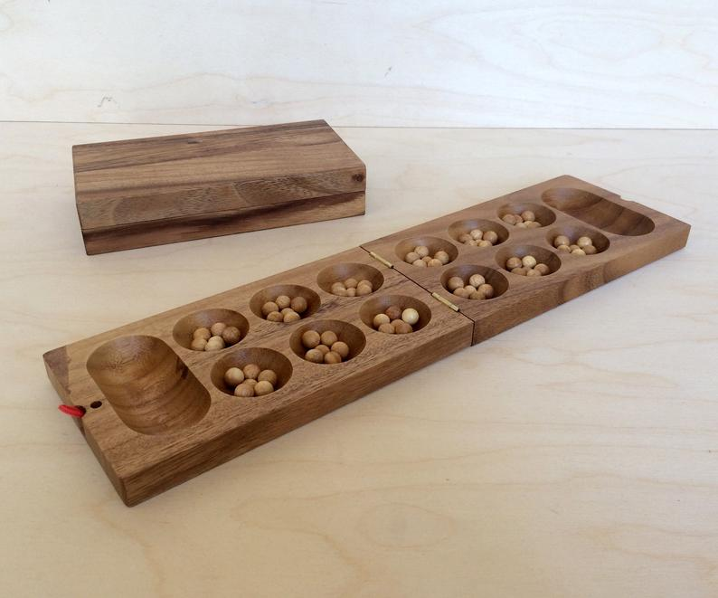

# Prolog programozás 6 - Projekt

## Kalah

Készítsünk mesterséges intelligenciát a *Kalah* mankala-játékhoz!



A játéknak számos variánsa létezik, itt most egy egyszerű változatot fogunk megvalósítani. A táblán 12 kisebb és 2 nagyobb lyuk található; az egyes játékosokhoz a hozzájuk közelebb levő 6 lyuk és a jobb kéz felőli nagyobb lyuk (a *kalah*) tartozik. Kezdetben minden (kis) lyukban 6 kő van, bár szokás 4-4 kővel is játszani.

A játékosok felváltva lépnek. Egy lépés abból áll, hogy választanak egy saját lyukat, amiben van kő, és a benne levő köveket óramutató járásával ellenkező irányban egyesével beleszórják a következő lyukakba - amikor elfogynak a sajátok, akkor egy kerül a saját kalahba, utána az ellenfél lyukaiba, és ha azok elfogytak, akkor megint a sajátokba (az ellenfél kalahját ki kell hagyni).

Ha az utolsó kő a (saját) kalahba esik, akkor még egyszer lehet lépni (ez bárhányszor ismételhető). Ha az utolsó kő egy olyan saját lyukba kerül, ami előtte üres volt, és a szemben levő lyukban van kő, akkor a szóró játékos mindkét lyuk tartalmát megkapja és a kalahjába teszi.

A játékot az nyeri meg, aki megszerzi a köveknek több, mint a felét. A játéknak akkor is vége van, ha egy lépés végeztével az egyik térfél teljesen kiürül - ilyenkor a másik játékos megkapja a saját oldalán levő köveket.

### Keretprogram

Ez már egy elég komplex program lesz, amit apránként fogunk felépíteni *top-down* módon, tehát először egy magas szinten fogalmazzuk meg, és utána kitöltjük a részleteket.

A Kalah az absztrakt táblajátékok általános sémáját követi; erre írhatunk egy olyan keretprogramot, ami később akár más hasonló jellegű játékokra is használható lesz:

```prolog
kalah :-
    alapbeállítás(Állás, Játékos),
    kirajzol(Állás, Játékos),
    játék(Állás, Játékos).

játék(Állás, Játékos) :-
    játék_vége(Állás, Játékos, Eredmény), !,
    bejelent(Eredmény).
játék(Állás, Játékos) :-
    lépést_választ(Állás, Játékos, Lépés),
    lép(Lépés, Állás, Állás1),
    következő_játékos(Játékos, Játékos1), !,
    kirajzol(Állás1, Játékos1),
    játék(Állás1, Játékos1).
```

Az `alapbeállítás` felállítja a tábla kezdő állapotát, és meghatározza a kezdő játékost. Ezt kirajzoljuk, és utána kezdődik a tényleges `játék/2`. Ez először ellenőrzi, hogy vége van-e a játéknak, és ha igen, közli az eredményt. Egyébként a soron következő játékos választ egy lépést, ezt a lépést le is játsza, majd a következő játékos számára kirajzolja a (módosult) állást és a játék megy tovább.

A két játékosunk lehet az `ember` és a `számítógép`, és ezek váltakoznak, tehát

```prolog
következő_játékos(ember, számítógép).
következő_játékos(számítógép, ember).
```

Az eredmény lehet egyszerűen a nyertes megnevezése, vagy a `döntetlen`:

```prolog
bejelent(ember) :- writeln('Nyertél, gratulálok!').
bejelent(számítógép) :- writeln('Nyertem.').
bejelent(döntetlen) :- writeln('Döntetlen lett!').
```

Itt a `writeln` a `write` olyan változata, ami utána még egy újsort is kiír (`nl`).

### Reprezentáció

A legfontosabb feladat itt is, mint mindig, a *reprezentáció* (adatábrázolás) ügyes megválasztása. Hogyan érdemes eltárolnunk az állást? A cél, hogy később kényelmesen le tudjuk írni a lépéseket.

Számozzuk be a lyukakat mindkét játékosnak balról jobbra 1-6-ig. A lépés tehát mindkét játékos számára egy 1 és 6 közötti szám lesz, vagyis pontosabban ezeknek egy listája, ugyanis ha az utolsó kő a kalahba kerül, akkor a játékos újra léphet, és így egy lépést a kiválasztott lyukak listájával lehet definiálni.

Az állást tehát a 2x6 lyukban, valamint a kalahokban levő kövek számával tudjuk leírni. A belső ábrázolásunk `tábla(La,Na,Lb,Nb)` alakú lesz, ahol `La` és `Lb` számok 6-elemű listája (a lyukakban levő kövek), `Na` és `Nb` sima számok (a kalahokban levő kövek). Az `a`-végűek az éppen soron következő játékoshoz tartozó adatok, a `b`-végűek az ellenfélhez tartozóak.

A játékot kezdje mindig az emberi játékos:

```prolog
alapbeállítás(Állás, ember) :-
    kövek_száma(K),
    Állás = tábla([K,K,K,K,K,K],0,
                  [K,K,K,K,K,K],0).

kövek_száma(6).
```

A kövek számát érdemes a fent látható módon kivenni külön ténybe, hogy később kényelmesen változtatható legyen.

### A Kalah szabályai

Mikor van vége a játéknak? Itt azt az egyszerűsítést alkalmazhatjuk, hogy ha az egyik térfél a lépés végére kiürül, akkor a másik térfélen levő kövek - még a lépés részeként - bekerülnek a megfelelő kalahba. Elég tehát azt a feltételt megnéznünk, hogy valamelyik játékos elvitte már a köveknek több, mint a felét.

```prolog
játék_vége(tábla(_,N,_,N), _, döntetlen) :-
    kövek_száma(K), N =:= 6 * K, !.
játék_vége(tábla(_,N1,_,_), Játékos, Játékos) :-
    kövek_száma(K), N1 > 6 * K, !.
játék_vége(tábla(_,_,_,N2), Játékos, Másik) :-
    kövek_száma(K), N2 > 6 * K,
    következő_játékos(Játékos, Másik).
```

Következik a lépések leírása. Ahogy láttuk, a lépés lyukak listájával van megadva. Ha a lista végére értünk, akkor a másik játékos következik, ezért meg kell "fordítani" a táblát:

```prolog
lép([], Állás, Állás1) :- megfordít(Állás, Állás1).

megfordít(tábla(La,Na,Lb,Nb), tábla(Lb,Nb,La,Na)).
```

Egyébként pedig körbeszórjuk (*vetjük*) a köveket:

```prolog
lép([L|M], Állás, Állás2) :-
    kövek(L, Állás, K),
    vet(K, L, Állás, Állás1),
    lép(M, Állás1, Állás2).
```

Itt a `kövek` megadja, hogy egy adott lyukban hány kő van:

```prolog
kövek(I, tábla(L,_,_,_), K) :- n_edik(I, L, K), K > 0.

n_edik(N, [_|M], X) :-
    N > 1, !, N1 is N - 1,
    n_edik(N1, M, X).
n_edik(1, [X|_], X).
```

A vetés a játék lelke, és egyben a legbonyolultabb része. Ezt két részre szedjük, a saját oldalon és az ellenfél oldalon való vetésre (utóbbi szükség szerint újra hivatkozik majd a `vet`-re):

```prolog
vet(Kövek, Luk, Állás, Állás2) :-
    vet_saját(Kövek, Luk, Állás, Állás1, Kövek1),
    vet_ellenfél(Kövek1, Állás1, Állás2).
```

Ez tehát azt mondja, hogy a `Luk` lyukból indulva vetünk `Kövek` darab követ, és így jutunk a kezdeti `Állás`-ból a végső `Állás2`-be. A saját oldali vetés végeztekor egy közbülső `Állás1`-be jutunk, ahol még további `Kövek1` darab követ kell vetnünk az ellenfél oldalára.

Ha a kövek száma nagyobb, mint 7 - `Luk`, akkor átjutunk az ellenfél oldalára (tehát az 1-es lyukból legalább 7 kő kell, a 2-esből 6, ..., a 6-osból legalább 2, hiszen az első a kalahba kerül):

```prolog
vet_saját(Kövek, Luk, tábla(La,Na,Lb,Nb),
          tábla(La1,Na1,Lb,Nb), Kövek1) :-
    Kövek > 7 - Luk, !, % átmegy az ellenfélhez
    felvesz_és_szór(Luk, Kövek, La, La1),
    Na1 is Na + 1, Kövek1 is Kövek + Luk - 7.
```

A lényeget a `felvesz_és_szór` végzi, amit kicsit későbbre hagyunk. Ha nem jutunk át a másik oldalra, akkor a megmaradó kövek száma 0:

```prolog
vet_saját(Kövek, Luk, tábla(La,Na,Lb,Nb), Állás, 0) :-
    Kövek =< 7 - Luk,
    felvesz_és_szór(Luk, Kövek, La, La1),
    elfogás(Luk, Kövek, La1, La2, Lb, Lb1, N),
    raktározás(N, Kövek, Luk, Na, Na1),
    vetés_vége(tábla(La2,Na1,Lb1,Nb), Állás).
```

Az `elfogás` megnézi, hogy hány követ ejtettünk foglyul (`N`), és hogy ennek hatására hogyan változik a tábla (új `La2` és `Lb1` értékek). A `raktározás` frissíti a kalah értékét (`Na1`), egyrészt az elfogott kövek, másrészt az aktuális vetés során oda jutó kő figyelembe vételével. Végül a `vetés_vége` ellenőrzi, hogy kiürült-e az egyik térfél, és ha igen, akkor a fennmaradó köveket a megfelelő kalahba teszi.

Nézzük meg ezeket sorban!

```prolog
elfogás(Luk, Kövek, La, La1, Lb, Lb1, N) :-
    Vége is Luk + Kövek,
    n_edik(Vége, La, 1),
    Szemben is 7 - Vége,
    n_edik(Szemben, Lb, K),
    K > 0, !, % üresbe érkeztünk és van szemben kő
    n_csere(Vége, La, 0, La1),
    n_csere(Szemben, Lb, 0, Lb1),
    N is K + 1.
elfogás(_, _, La, La, Lb, Lb, 0) :- !.

n_csere(1, [_|M], Y, [Y|M]) :- !.
n_csere(N, [X|M], Y, [X|M1]) :-
    N > 1, !, N1 is N - 1,
    n_csere(N1, M, Y, M1).
```

A `Vége` adja meg, hogy melyik lyukba kerül az utolsó kő. Ha ebben 1 kő van, tehát a vetés előtt üres volt, akkor megvizsgáljuk, hogy szemben van-e kő (a szemben levő lyukak számozásának iránya fordított, ezért a megfelelő index a 7 - `Vége` lesz). Ha ez is teljesül, akkor kinullázzuk ezt a két lyukat az `n_csere(I, L, X, L1)` használatával, ami az `L` lista `I`-edik elemét `X`-re állítja. Végül a kapott kövek száma a szemben levő kövek száma + 1. Ellenkező esetben a tábla változatlan marad és a kapott kövek száma 0 lesz.

Figyeljük meg, hogy itt az aránylag bonyolult feltételt nem ismételjük meg a második szabályban, hanem a procedurális olvasatra hagyatkozunk: az első szabályban levő vágás miatt a másodikba csak akkor jutunk, ha a feltétel nem teljesül. Ez a deklaratív olvasatot elrontja, de megengedhető, mivel tudjuk, hogy csak olyan környezetben használjuk, ahol az `La1`, `Lb1` és `N` változóknak nincsen értéke. A hatékonyság érdekében sok szabály használja itt ezt a módszert.

A `raktározás` elég magától értetődő. Ha az elfogott kövek száma 0, akkor ellenőrzi, hogy az utolsó kő a kalahba került-e, egyébként csak hozzáadja az eddigiekhez az elfogott köveket:

```prolog
raktározás(0, Kövek, Luk, Na, Na) :-
    Kövek < 7 - Luk, !.
raktározás(0, Kövek, Luk, Na, Na1) :-
    Kövek =:= 7 - Luk, !, Na1 is Na + 1.
raktározás(N, _, _, Na, Na1) :-
    N > 0, !, Na1 is Na + N.
```

A kiürült térfelek kezelésekor a másik térfél köveit összeadjuk, és azt is kiürítjük:

```prolog
vetés_vége(tábla(La,Na,Lb,Nb), tábla(La,Na,La,Nb1)) :-
    üres(La), !, összeg(Lb, X), Nb1 is Nb + X.
vetés_vége(tábla(La,Na,Lb,Nb), tábla(Lb,Na1,Lb,Nb)) :-
    üres(Lb), !, összeg(La, X), Na1 is Na + X.
vetés_vége(Állás, Állás) :- !.

üres([0,0,0,0,0,0]).

összeg(L, X) :- összeg(L, 0, X).

összeg([], A, A).
összeg([K|M], A, X) :-
    A1 is A + K,
    összeg(M, A1, X).
```

A saját oldali vetéssel így már majdnem készen vagyunk, csak a `felvesz_és_szór` hiányzik:

```prolog
felvesz_és_szór(0, K, L, L1) :- % szórás folytatása
    !, szór(K, L, L1).
felvesz_és_szór(1, K, [_|M], [0|M1]) :-
    !, szór(K, M, M1).
felvesz_és_szór(Luk, K, [L|M], [L|M1]) :-
    Luk > 1, !, Luk1 is Luk - 1,
    felvesz_és_szór(Luk1, K, M, M1).
```

A `K` itt a szórandó kövek számát adja meg, a `Luk` pedig a lyuknak a száma, ahonnan szórunk. Ha a `Luk` értéke 0, az azt jelenti, hogy egy korábban elkezdődött vetés folytatódik, és az első kőnek az 1-es számú lyukba kell esnie. (A tényleges szórást a `szór` végzi.) Ha a `Luk` száma az 1-es, akkor a kapott lyuk-lista első elemét kinullázzuk (kivesszük belőle a köveket), a többit pedig a `szór` segítségével módosítjuk. Végül ha a `Luk` száma nagyobb, mint 1, akkor a lyuk-lista első eleme megmarad, a maradékot pedig rekurzív hívással tudjuk megadni.

A szórásnál lyukanként haladunk, és mindegyikbe egy kerül, amíg vagy nincs több lyuk, vagy nincs több kő:

```prolog
szór(0, L, L) :- !.
szór(N, [L|M], [L1|M1]) :-
    N > 0, !,
    N1 is N - 1, L1 is L + 1,
    szór(N1, M, M1).
szór(_, [], []) :- !.
```

Hátra van még a vetés az ellenfél oldalán. Itt 4 esetet különböztetünk meg:

1. A vetni való kövek száma 0. Ilyenkor nincs teendő.
2. A kövek száma 1 és 6 között van (tehát nem jön vissza hozzánk), és a mi térfelünk nem üres. Ilyenkor egyszerűn végig kell szórni ezeket a köveket.
3. A kövek száma 1 és 6 között van, és a saját térfél üres. Ilyenkor az ellenfél kalahjába bekerülnek a szórandó kövek és az ellenfél térfelén levők is.
4. A kövek száma több, mint 6. Ekkor a kövek végigszórása után 6-al kevesebb kővel egy újabb vetést kell indítani a saját térfél "0-dik" lyukából.

Ennek megfelel az alábbi 4 szabály:

```prolog
vet_ellenfél(0, Állás, Állás) :- !.
vet_ellenfél(Kövek, tábla(La,Na,Lb,Nb),
             tábla(La,Na,Lb1,Nb)) :-
    1 =< Kövek, Kövek =< 6,
    \+ üres(La), !,
    szór(Kövek, Lb, Lb1).
vet_ellenfél(Kövek, tábla(La,Na,Lb,Nb),
             tábla(La,Na,La,Nb1)) :-
    1 =< Kövek, Kövek =< 6,
    üres(La), !,
    összeg(Lb, X), Nb1 is Nb + Kövek + X.
vet_ellenfél(Kövek, tábla(La,Na,Lb,Nb), Állás) :-
    Kövek > 6, !,
    szór(6, Lb, Lb1),
    Kövek1 is Kövek - 6,
    vet(Kövek1, 0, tábla(La,Na,Lb1,Nb), Állás).
```

### Kirajzolás

A nehezén túl vagyunk, de ahhoz, hogy játszani is tudjunk, meg is kell valahogy jeleníteni a táblát, és kommunikálni kell a játékossal.

A tábla így fog kinézni:

```
     6    6    6    6    6    6
0                                  0
     6    6    6    6    6    6
```

A kirajzolásnál mindig a(z ember) játékos sora lesz alul, tehát a számítógép sorát kell elsőnek kiírni. Ezt úgy érjük el, hogy ha a játékos jön, akkor megfordítjuk a táblát a tényleges kirajzolás előtt:

```prolog
kirajzol(Állás, számítógép) :- kirajzol(Állás).
kirajzol(Állás, ember) :-
    megfordít(Állás, Állás1),
    kirajzol(Állás1).
```

A két sor kiírását a `sort_ír` végzi, a kalahokét a `kalahot_ír`. A felső sor számozása jobbról balra történik, tehát ezt a listát meg kell fordítani kiírás előtt:

```prolog
kirajzol(tábla(La,Na,Lb,Nb)) :-
    nl,
    fordított(La, F),
    sort_ír(F),
    kalahot_ír(Na, Nb),
    sort_ír(Lb).
```

A sorokat 5 szóköznyi behúzással indítjuk, hogy legyen hely a baloldali kalahnak is. Ehhez a `tab` szabályt használjuk - ez az SWI Prolog netes verziójában nem használható (és a `write` is nagyon lassú), ezért érdemes a letölthető verzióban tesztelni.

```prolog
sort_ír(L) :- tab(5), lyukat_ír(L).

lyukat_ír([]) :- nl.
lyukat_ír([L|M]) :- köveket_ír(L), lyukat_ír(M).

köveket_ír(N) :- N < 10, write(N), tab(4).
köveket_ír(N) :- N >= 10, write(N), tab(3).

kalahot_ír(N1, N2) :- köveket_ír(N1), tab(30), write(N2), nl.
```

A `köveket_ír` mindig 3 vagy 4 szóközt ír annak függvényében, hogy egy- vagy kétjegyű a kövek száma.

### Próba 2 játékosos módban

A mesterséges intelligencia még nincs meg, de a program már majdnem tesztelhető. Csak a `lépést_választ` hiányzik, amit egyelőre írjunk meg úgy, hogy mindig a játékost kérdezi:

```prolog
lépést_választ(_, _, Lépés) :-
    nl, writeln('Melyiket választod?'),
    read(Lépés), érvényes(Lépés).

érvényes([]).
érvényes([L|M]) :- 0 < L, L < 7, érvényes(M).
```

A lépés érvényességére csak egy minimális ellenőrzés van, azt sem ellenőrzi, hogy nem kéne-e folytatnunk a lépést vagy hogy nem léptünk-e túl sokszor (de ld. lejjebb az 2. feladatot).

Itt egy pár lépés ízelítőnek:

```
?- kalah.

     6    6    6    6    6    6
0                                  0
     6    6    6    6    6    6

Melyiket választod?
|: [1,5].

     6    7    7    7    7    7
0                                  2
     0    7    7    7    0    8

Melyiket választod?
|: [3].

     7    8    8    0    7    7
1                                  2
     1    8    8    7    0    8

Melyiket választod?
|: [2].

     7    8    8    1    8    8
1                                  3
     1    0    9    8    1    9

Melyiket választod?
|: [1].

     8    9    9    2    9    0
2                                  3
     2    1    9    8    1    9

Melyiket választod?
|: [6].

     9    10   10   3    10   1
2                                  4
     3    2    9    8    1    0

Melyiket választod?
|: [3].

     10   11   11   0    10   1
2                                  4
     3    2    9    8    1    0

Melyiket választod?
|: [5].

     10   11   11   0    10   0
2                                  6
     3    2    9    8    0    0

Melyiket választod?
|: vége.

false.
```

A program jelenleg tetszőleges hibás lépésre (pl. `vége`) leáll. Kipróbálhatjuk egy-egy speciális esetre is, mint például ez:

```
?- Állás = tábla([1,1,1,1,1,1],23,[16,3,1,1,3,3],16),
   kirajzol(Állás, ember), játék(Állás, ember).

     3    3    1    1    3    16
16                                  23
     1    1    1    1    1    1

Melyiket választod?
|: [6,5].

     3    3    1    1    3    0
16                                  41
     1    1    1    1    0    0
Nyertél, gratulálok!
```

### Alfa-béta nyírás keretprogram

A számítógép az ún. *alfa-béta nyírás* algoritmusa szerint fog működni. Ennek a lényege az, hogy minden játékálláshoz tudunk rendelni egy számot, ami minél magasabb, annál kedvezőbb nekünk. Ezután végiggondoljuk az összes lépési lehetőséget (az ellenfél lépéseit is természetesen) valahány lépésre előre, ezt a lépésszámot *mélységnek* szokás nevezni.

Nézzünk egy nagyon egyszerű példát! Az alábbi ábra lépések *fáját* mutatja: a pontok és számok játékállásokat jelölnek, míg a köztük levő szakaszok a lépéseket.

```
       .        <- mostani helyzet
      / \
     /   \
    /     \
   .       .    <- mi lépésünk után
  / \     / \
 1   2  -1   3  <- ellenfél lépése után
```

Itt a mélység 2, tehát 2 lépésre előre gondolkodunk, és a legmélyebb szinten kiértékelünk minden állást. Két lépéslehetőségünk van, és ezekre az ellenfélnek 2-2 válasza. Feltesszük, hogy az ellenfelünk jól játszik, tehát ha a baloldali lépést választjuk, arra az ellenfél a saját baloldali (1-es értékelésű) lépését fogja válaszolni, nem pedig a jobboldalit, ami nekünk kedvezőbb állást (2) eredményez. Hasonlóan járunk el a jobboldali lépésnél: az ellenfél két válasza közül feltételezzük a kisebbet (-1). Azt láttuk tehát, hogy a baloldali lépés legrosszabb esetben 1-es, a jobboldali -1-es értékelésű. Mi nyilván a nagyobbat választjuk, tehát a mostani helyzetünk 1-es értékelésű lesz:

```
       1        <- mostani helyzet
      / \
     /   \
    /     \
   1      -1    <- mi lépésünk után
  / \     / \
 1   2  -1   3  <- ellenfél lépése után
```

Ha itt kell lépést választani, akkor a baloldali mellett döntünk. Ezt a gondolkodást *minimax* algoritmusnak hívják, mivel az ellenfél lépései közül a minimális értékűt, a saját lépések közül a maximális értékűt választjuk.

Az alfa-béta nyírás ennek egy hatékonyabb változata. Itt mindig számon tartjuk azt, hogy mi az a minimum, amit biztosan el tudunk érni (*alfa*), és mi az a maximum, amit elérhetünk (*béta*). Nézzük meg az előbbi példa kiértékelését, amikor már megvizsgáltuk a teljes baloldali ágat!

```
       .        <- mostani helyzet
      / \
     /   \
    /     \
   1       .    <- mi lépésünk után
  / \     / \
 1   2   .   .  <- ellenfél lépése után
```

A jobboldali ággal még egyáltalán nem foglalkoztunk. Azt tudjuk, hogy ha a baloldali lépést választjuk, legrosszabb esetben 1-es (tehát alfa = 1). Hogyan módosul ez a jobboldali lépésre adott baloldali válasz megvizsgálása után?

```
       .        <- mostani helyzet
      / \
     /   \
    /     \
   1       .    <- mi lépésünk után
  / \     / \
 1   2  -1   .  <- ellenfél lépése után
```

Azt látjuk, hogy ha a jobboldali lépést választjuk, akkor legjobb esetben -1-re számíthatunk (béta = -1). Lehet, hogy az ellenfélnek van egy még erősebb lépése, és a tényleges maximum még kisebb, de nagyobb nem lehet. Viszont a baloldali ágon már van egy biztos 1-es, tehát ezt az ágat nem érdemes tovább vizsgálni, le lehet "nyírni". Általában tehát ha egy ágon a béta érték kisebb vagy egyenlő, mint az eddigi legjobb alfa, akkor nem kell vele foglalkozni.

Az algoritmust teljesen általánosan meg lehet fogalmazni, a konkrét játéktól függetlenül. Csak azt feltételezzük, hogy a következők adottak:

- `lépés(Állás, Lépés)` : adott állásból lehetséges lépés
- `lép(Lépés, Állás, Állás1)` : adott lépés lejátszása
- `értékelés(Állás, Érték)` : adott állás kiértékelése

Ebből egyelőre csak a második van meg, a maradék kettőt a következő részben fogjuk elkészíteni. Most azonban nézzük az általános algoritmust! Hogy ne kelljen külön kezelni a minimum- és maximumkereső eseteket, az értékeléseket minden szintváltáskor negáljuk. Ahhoz, hogy ez működjön, feltételezzük, hogy a keresési mélység kezdetben páros, tehát a 0-ás mélységen a pozitív szám jelenti a nekünk jó állást.

```prolog
alfa_béta(0, Állás, _, _, (_, Érték)) :-
    értékelés(Állás, Érték).
alfa_béta(Mélység, Állás, Alfa, Béta, (Lépés, Érték)) :-
    Mélység > 0, Mélység1 is Mélység - 1,
    Alfa1 is -Béta, Béta1 is -Alfa,
    findall(L, lépés(Állás, L), Lépések),
    választ(Lépések, Állás, Mélység1, Alfa1, Béta1,
            nincs, (Lépés, Érték)).
```

Ha az előrelátás mélysége 0, akkor az aktuális állást egyszerűen kiértékeljük. (Ilyenkor a legjobb lépést jelölő `Lépés` nem kap értéket.) Ha a mélység legalább 1, akkor eggyel csökkentjük, negáljuk és megcseréljük az alfát és bétát (hogy a másik játékos szemszögébe kerüljünk), és választunk az összes lehetséges lépés közül.

(Megjegyzés: A `(Lépés, Érték)` egy *pár* - ez is egy struktúra, aminek a funktora a vessző, tehát ez valójában úgy is írható, hogy `','(Lépés, Érték)`, és általánosan az `(a,b) =.. [',',a,b].` teljesül.)

A választást a `választ` végzi:

```prolog
választ([], _, _, Alfa, _, Legjobb, (Legjobb, Alfa)).
választ([Lépés|M], Állás, Mélység, Alfa, Béta, Legjobb, X) :-
    lép(Lépés, Állás, Állás1),
    alfa_béta(Mélység, Állás1, Alfa, Béta, (_, Érték)),
    Érték1 is -Érték,
    nyír((Lépés, Érték1), Mélység, Alfa, Béta, M, Állás, Legjobb, X).
```

Az utolsóelőtti argumentum az eddigi legjobb lépés (kezdetben `nincs`), az utolsó pedig a végső megtalált legjobb lépés és a hozzá tartozó értékelés.

Ha a lehetséges lépések listája üres, akkor az eddigi legjobb lépést adja vissza (`Legjobb`) és a hozzá tartozó érték az  `Alfa` lesz. Ha nem üres, akkor kipróbálja az első lépést: lejátsza, és az így keletkező állást (rekurzívan) kiértékeli az `alfa_béta` szabállyal. Az így kapott `Érték`-et negálni kell, mert egy szinttel feljebb léptünk. Végül a `nyír` az eredeti `Állás` állapotból való lépések közül (rekurzívan) választ, miközben lenyírja azokat az ágakat, amelyeket felesleges kiértékelni:

```prolog
nyír((Lépés, Érték), _, _, Béta, _, _, _, (Lépés, Érték)) :-
    Érték >= Béta.
nyír((Lépés, Érték), Mélység, Alfa, Béta, Többi, Állás, _, X) :-
    Alfa < Érték, Érték < Béta,
    választ(Többi, Állás, Mélység, Érték, Béta, Lépés, X).
nyír((_, Érték), Mélység, Alfa, Béta, Többi, Állás, Lépés1, X) :-
    Érték =< Alfa,
    választ(Többi, Állás, Mélység, Alfa, Béta, Lépés1, X).
```

Itt három esetet különböztetünk meg, a megvizsgált lépés értékelésétől függően:

1. Ha legalább béta, akkor nem kell tovább keresni, ennél jobb lépés nem változtat az értékelésen. (Ez megfelel annak, hogy a fenti példában megtaláltuk a -1-et, ami az ellenfél számára negálva 1-es, és ezért nem kell még jobb lépés után néznie, mert a béta - a mi negált alfánk - kisebb, -1 értékű.)
2. Ha alfa és béta között van, akkor ez lesz az eddigi legjobb lépés és az értéke az új alfa, és keresünk egy esetleges jobbat a többi lépésből.
3. Ha kisebb vagy egyenlő, mint alfa, akkor ez a lépés nem érdekes, a többiekben folytatjuk a keresést.

### Kalah-specifikus részek

Hogyan tudjuk az összes lehetséges lépést leírni?

```prolog
lépés(tábla([0,0,0,0,0,0],_,_,_), []).
lépés(Állás, [L|M]) :-
    tartalmaz(L, [1,2,3,4,5,6]),
    kövek(L, Állás, K),
    lépést_folytat(K, L, Állás, M).
```

Ha a térfelünk üres, nincs lehetséges lépés. (Erre azért van szükség, mert a játékot be lehet fejezni úgy, hogy az utolsó követ a kalahba rakjuk.) Egyébként a lépés első eleme egy lyukat jelölő 1 és 6 közti szám; a `kövek` biztosítja, hogy van is benne kő. Azt kell csak ellenőrizni, hogy a kalahba kerül-e az utolsó, amire a feltétel a 13-al való osztási maradékkal számolható:

```prolog
lépést_folytat(Kövek, L, _, []) :-
    Kövek =\= (7 - L) mod 13, !.
lépést_folytat(Kövek, L, Állás, Lépések) :-
    Kövek =:= (7 - L) mod 13, !,
    vet(Kövek, L, Állás, Állás1),
    lépés(Állás1, Lépések).
```

Ha a kalahba került, akkor a köveket végigszórjuk, és ebből az állásból rekurzívan további lépéseket keresünk.

Egy állás értékelésére egy nagyon egyszerű definíció a kalahokban levő kövek különbsége:

```prolog
értékelés(tábla(_,Na,_,Nb), X) :- X is Na - Nb.
```

Már csak annyi van hátra, hogy átírjuk a `lépést_választ` szabályt. A régi verzió megmarad arra az esetre, amikor az emberi játékos van lépésen; a számítógép esetében pedig az alfa-béta nyírást használjuk:

```prolog
lépést_választ(_, ember, Lépés) :-
    nl, writeln('Melyiket választod?'),
    read(Lépés), érvényes(Lépés).
lépést_választ(Állás, számítógép, Lépés) :-
    előrelátás(Mélység),
    alfa_béta(Mélység, Állás, -40, 40, (Lépés, _)),
    nl, write(Lépés), nl.

előrelátás(4).
```

Az alfa-béta intervallumot kezdetben jó nagyra állítjuk (-40, 40), az előrelátás mélységét pedig a könnyebb módosíthatóság kedvéért egy külön tényként tároljuk.

### Tesztjáték

Itt egy 6-os mélységű mesterséges intelligencia ellen játszott 4-köves játék, ahol a gép kezdett:

```
?- kalah.

     4    4    4    4    4    4
0                                  0
     4    4    4    4    4    4

[3,6]

     0    5    5    0    4    4
2                                  0
     5    5    5    5    4    4

Melyiket választod?
|: [2,1].

     0    5    5    0    4    4
2                                  1
     0    1    7    7    6    6

[4]

     1    6    0    0    4    4
3                                  1
     1    2    7    7    6    6

Melyiket választod?
|: [1].

     1    6    0    0    4    4
3                                  1
     0    3    7    7    6    6

[5]

     2    0    0    0    4    4
4                                  1
     1    4    8    8    6    6

Melyiket választod?
|: [2].

     2    0    0    0    4    4
4                                  1
     1    0    9    9    7    7

[6]

     0    0    0    0    4    4
5                                  1
     2    0    9    9    7    7

Melyiket választod?
|: [1].

     0    0    0    0    4    4
5                                  1
     0    1    10   9    7    7

[1]

     0    0    1    1    5    0
7                                  1
     0    0    10   9    7    7

Melyiket választod?
|: [5].

     0    1    2    2    6    1
7                                  2
     0    0    10   9    0    8

[1]

     0    1    2    2    7    0
7                                  2
     0    0    10   9    0    8

Melyiket választod?
|: [6].

     0    2    3    3    8    1
7                                  5
     0    0    10   9    0    0

[5,6,4,6,1]

     0    1    0    3    9    0
11                                 5
     0    0    10   9    0    0

Melyiket választod?
|: [3].

     1    2    1    4    10   1
11                                 6
     0    0    0    10   1    1

[6,5,4]

     1    1    0    4    10   1
13                                 6
     0    0    0    10   1    1

Melyiket választod?
|: [4].

     0    2    1    5    11   2
13                                 10
     0    0    0    0    2    2

[1]

     0    2    1    6    12   0
13                                 10
     0    0    0    0    2    2

Melyiket választod?
|: [6].

     0    2    1    6    12   1
13                                 11
     0    0    0    0    2    0

[1]

     0    2    1    6    13   0
13                                 11
     0    0    0    0    2    0

Melyiket választod?
|: [5,6].

     0    0    0    0    0    0
35                                 13
     0    0    0    0    0    0
Nyertem.
```

### Feladatok

1. Írjátok át a játékos lépését, hogy hibás lépés esetén kérdezzen újra, és `kilépés`-re lépjen ki!

2. Készítsetek szigorúbb ellenőrzést az emberi játékos lépéseihez, ami (i) nem enged üres lyukat választani, és (ii) akkor és csak akkor enged több lépést, ha az utolsó kő a kalahba kerül!

3. Írjátok át a programot úgy, hogy a bonyolultabb (de izgalmasabb) [Oware](https://boardgamegeek.com/boardgame/28302/oware) játék szabályait kövesse!

### A teljes program

```prolog
% Magas szintű keretprogram

kalah :-
    alapbeállítás(Állás, Játékos),
    kirajzol(Állás, Játékos),
    játék(Állás, Játékos).

játék(Állás, Játékos) :-
    játék_vége(Állás, Játékos, Eredmény), !,
    bejelent(Eredmény).
játék(Állás, Játékos) :-
    lépést_választ(Állás, Játékos, Lépés),
    lép(Lépés, Állás, Állás1),
    következő_játékos(Játékos, Játékos1), !,
    kirajzol(Állás1, Játékos1),
    játék(Állás1, Játékos1).

következő_játékos(ember, számítógép).
következő_játékos(számítógép, ember).

bejelent(ember) :- writeln('Nyertél, gratulálok!').
bejelent(számítógép) :- writeln('Nyertem.').
bejelent(döntetlen) :- writeln('Döntetlen lett!').

% Reprezentáció

alapbeállítás(Állás, ember) :-
    kövek_száma(K),
    Állás = tábla([K,K,K,K,K,K],0,
                  [K,K,K,K,K,K],0).

% Szabályok

játék_vége(tábla(_,N,_,N), _, döntetlen) :-
    kövek_száma(K), N =:= 6 * K, !.
játék_vége(tábla(_,N1,_,_), Játékos, Játékos) :-
    kövek_száma(K), N1 > 6 * K, !.
játék_vége(tábla(_,_,_,N2), Játékos, Másik) :-
    kövek_száma(K), N2 > 6 * K,
    következő_játékos(Játékos, Másik).

lép([], Állás, Állás1) :- megfordít(Állás, Állás1).
lép([L|M], Állás, Állás2) :-
    kövek(L, Állás, K),
    vet(K, L, Állás, Állás1),
    lép(M, Állás1, Állás2).

megfordít(tábla(La,Na,Lb,Nb), tábla(Lb,Nb,La,Na)).

kövek(I, tábla(L,_,_,_), K) :- n_edik(I, L, K), K > 0.

vet(Kövek, Luk, Állás, Állás2) :-
    vet_saját(Kövek, Luk, Állás, Állás1, Kövek1),
    vet_ellenfél(Kövek1, Állás1, Állás2).

vet_saját(Kövek, Luk, tábla(La,Na,Lb,Nb),
          tábla(La1,Na1,Lb,Nb), Kövek1) :-
    Kövek > 7 - Luk, !, % átmegy az ellenfélhez
    felvesz_és_szór(Luk, Kövek, La, La1),
    Na1 is Na + 1, Kövek1 is Kövek + Luk - 7.
vet_saját(Kövek, Luk, tábla(La,Na,Lb,Nb), Állás, 0) :-
    Kövek =< 7 - Luk,
    felvesz_és_szór(Luk, Kövek, La, La1),
    elfogás(Luk, Kövek, La1, La2, Lb, Lb1, N),
    raktározás(N, Kövek, Luk, Na, Na1),
    vetés_vége(tábla(La2,Na1,Lb1,Nb), Állás).

felvesz_és_szór(0, K, L, L1) :- % szórás folytatása
    !, szór(K, L, L1).
felvesz_és_szór(1, K, [_|M], [0|M1]) :-
    !, szór(K, M, M1).
felvesz_és_szór(Luk, K, [L|M], [L|M1]) :-
    Luk > 1, !, Luk1 is Luk - 1,
    felvesz_és_szór(Luk1, K, M, M1).

szór(0, L, L) :- !.
szór(N, [L|M], [L1|M1]) :-
    N > 0, !,
    N1 is N - 1, L1 is L + 1,
    szór(N1, M, M1).
szór(_, [], []) :- !.

elfogás(Luk, Kövek, La, La1, Lb, Lb1, N) :-
    Vége is Luk + Kövek,
    n_edik(Vége, La, 1),
    Szemben is 7 - Vége,
    n_edik(Szemben, Lb, K),
    K > 0, !, % üresbe érkeztünk és van szemben kő
    n_csere(Vége, La, 0, La1),
    n_csere(Szemben, Lb, 0, Lb1),
    N is K + 1.
elfogás(_, _, La, La, Lb, Lb, 0) :- !.

raktározás(0, Kövek, Luk, Na, Na) :-
    Kövek < 7 - Luk, !.
raktározás(0, Kövek, Luk, Na, Na1) :-
    Kövek =:= 7 - Luk, !, Na1 is Na + 1.
raktározás(N, _, _, Na, Na1) :-
    N > 0, !, Na1 is Na + N.

vetés_vége(tábla(La,Na,Lb,Nb), tábla(La,Na,La,Nb1)) :-
    üres(La), !, összeg(Lb, X), Nb1 is Nb + X.
vetés_vége(tábla(La,Na,Lb,Nb), tábla(Lb,Na1,Lb,Nb)) :-
    üres(Lb), !, összeg(La, X), Na1 is Na + X.
vetés_vége(Állás, Állás) :- !.

üres([0,0,0,0,0,0]).

vet_ellenfél(0, Állás, Állás) :- !.
vet_ellenfél(Kövek, tábla(La,Na,Lb,Nb),
             tábla(La,Na,Lb1,Nb)) :-
    1 =< Kövek, Kövek =< 6,
    \+ üres(La), !,
    szór(Kövek, Lb, Lb1).
vet_ellenfél(Kövek, tábla(La,Na,Lb,Nb),
             tábla(La,Na,La,Nb1)) :-
    1 =< Kövek, Kövek =< 6,
    üres(La), !,
    összeg(Lb, X), Nb1 is Nb + Kövek + X.
vet_ellenfél(Kövek, tábla(La,Na,Lb,Nb), Állás) :-
    Kövek > 6, !,
    szór(6, Lb, Lb1),
    Kövek1 is Kövek - 6,
    vet(Kövek1, 0, tábla(La,Na,Lb1,Nb), Állás).

% Kirajzolás

kirajzol(Állás, számítógép) :- kirajzol(Állás).
kirajzol(Állás, ember) :-
    megfordít(Állás, Állás1),
    kirajzol(Állás1).

kirajzol(tábla(La,Na,Lb,Nb)) :-
    nl,
    fordított(La, F),
    sort_ír(F),
    kalahot_ír(Na, Nb),
    sort_ír(Lb).

sort_ír(L) :- tab(5), lyukat_ír(L).

lyukat_ír([]) :- nl.
lyukat_ír([L|M]) :- köveket_ír(L), lyukat_ír(M).

köveket_ír(N) :- N < 10, write(N), tab(4).
köveket_ír(N) :- N >= 10, write(N), tab(3).

kalahot_ír(N1, N2) :- köveket_ír(N1), tab(30), write(N2), nl.

% Alfa-béta nyírás

alfa_béta(0, Állás, _, _, (_, Érték)) :-
    értékelés(Állás, Érték).
alfa_béta(Mélység, Állás, Alfa, Béta, (Lépés, Érték)) :-
    Mélység > 0, Mélység1 is Mélység - 1,
    Alfa1 is -Béta, Béta1 is -Alfa,
    findall(L, lépés(Állás, L), Lépések),
    választ(Lépések, Állás, Mélység1, Alfa1, Béta1,
            nincs, (Lépés, Érték)).

választ([], _, _, Alfa, _, Legjobb, (Legjobb, Alfa)).
választ([Lépés|M], Állás, Mélység, Alfa, Béta, Legjobb, X) :-
    lép(Lépés, Állás, Állás1),
    alfa_béta(Mélység, Állás1, Alfa, Béta, (_, Érték)),
    Érték1 is -Érték,
    nyír((Lépés, Érték1), Mélység, Alfa, Béta, M, Állás, Legjobb, X).

nyír((Lépés, Érték), _, _, Béta, _, _, _, (Lépés, Érték)) :-
    Érték >= Béta.
nyír((Lépés, Érték), Mélység, Alfa, Béta, Többi, Állás, _, X) :-
    Alfa < Érték, Érték < Béta,
    választ(Többi, Állás, Mélység, Érték, Béta, Lépés, X).
nyír((_, Érték), Mélység, Alfa, Béta, Többi, Állás, Lépés1, X) :-
    Érték =< Alfa,
    választ(Többi, Állás, Mélység, Alfa, Béta, Lépés1, X).

% Kalah-specifikus rész

lépés(tábla([0,0,0,0,0,0],_,_,_), []).
lépés(Állás, [L|M]) :-
    tartalmaz(L, [1,2,3,4,5,6]),
    kövek(L, Állás, K),
    lépést_folytat(K, L, Állás, M).

lépést_folytat(Kövek, L, _, []) :-
    Kövek =\= (7 - L) mod 13, !.
lépést_folytat(Kövek, L, Állás, Lépések) :-
    Kövek =:= (7 - L) mod 13, !,
    vet(Kövek, L, Állás, Állás1),
    lépés(Állás1, Lépések).

értékelés(tábla(_,Na,_,Nb), X) :- X is Na - Nb.

lépést_választ(_, ember, Lépés) :-
    nl, writeln('Melyiket választod?'),
    read(Lépés), érvényes(Lépés).
lépést_választ(Állás, számítógép, Lépés) :-
    előrelátás(Mélység),
    alfa_béta(Mélység, Állás, -40, 40, (Lépés, _)),
    nl, write(Lépés), nl.

érvényes([]).
érvényes([L|M]) :- 0 < L, L < 7, érvényes(M).

% Beállítások

kövek_száma(6).

előrelátás(4).

% Segéd-szabályok

tartalmaz(X, [X|_]).
tartalmaz(X, [_|Maradék]) :- tartalmaz(X, Maradék).

fordított(X, Y) :- fordított(X, [], Y).

fordított([], Y, Y).
fordított([X|M], F, Y) :- fordított(M, [X|F], Y). 

n_edik(N, [_|M], X) :-
    N > 1, !, N1 is N - 1,
    n_edik(N1, M, X).
n_edik(1, [X|_], X).

n_csere(1, [_|M], Y, [Y|M]) :- !.
n_csere(N, [X|M], Y, [X|M1]) :-
    N > 1, !, N1 is N - 1,
    n_csere(N1, M, Y, M1).

összeg(L, X) :- összeg(L, 0, X).

összeg([], A, A).
összeg([K|M], A, X) :-
    A1 is A + K,
    összeg(M, A1, X).
```

## Megjegyzések

Ez a dokumentum az alábbi könyv 20.2. és 21.3. fejezete alapján készült:

L. Sterling, E. Shapiro: *The Art of Prolog*, 2nd Ed., MIT Press, 1994.
